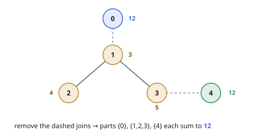

# Cutting a Tree Into Equal-Sum Parts

## Description

You are given a tree on `n` nodes numbered `0` through `n - 1`. Node `i`
carries the value `nums[i]`, and the array `edges` lists the `n - 1`
undirected joins, `edges[j] = [a, b]` linking nodes `a` and `b`.

Removing joins breaks the tree into connected parts. A part's worth is the
sum of the values of the nodes it contains.

Return the largest number of joins you can remove so that every remaining
part has the same worth.

### Example 1

```text
Input: nums = [12,3,4,5,12], edges = [[0,1],[1,2],[1,3],[3,4]]
Output: 2
Explanation: Remove the joins [0,1] and [3,4]. The parts are {0}, {1,2,3} and
{4}, each worth 12. A four-part split would need parts worth 36 / 4 = 9, but
node 0 alone is worth 12 and cannot be divided, so no three-join removal
works.
```



### Example 2

```text
Input: nums = [5], edges = []
Output: 0
Explanation: One node is already a single part, and there is nothing to
remove.
```

### Constraints

- `1 <= n <= 2 * 10⁴`
- `nums.length == n`
- `1 <= nums[i] <= 50`
- `edges.length == n - 1`
- `edges[j].length == 2`
- `0 <= edges[j][0], edges[j][1] <= n - 1`
- the joins listed in `edges` form a tree.

### Follow-up

An `O(n · d)` algorithm exists, where `d` is how many divisors the combined
node value has. Can you find it?

## Hints

### Hint 1

If the tree falls into `k` equal parts, each is worth `total / k` — so only
some `k` are even worth trying. Which ones?

### Hint 2

Root the tree anywhere and compute every subtree sum in one sweep. What does
divisibility say about the topmost node of any valid part?

### Hint 3

For a target worth `v`, count the nodes whose subtree sum is a multiple of
`v`; the `k`-part split exists exactly when that count reaches `k`. Walk `k`
from the most parts to the fewest and stop at the first success.
