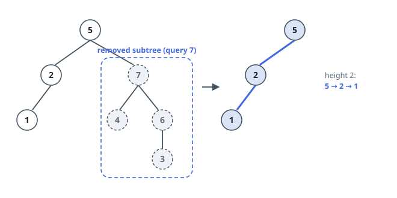

# Tree Height After Subtree Cuts

## Description

A binary tree with `n` nodes is given by its `root`, and the node values are
the distinct integers `1` to `n`. Alongside it comes an array `queries` of `m`
values, each naming one node.

Every entry of `queries` describes one isolated experiment: delete the whole
subtree growing from the node whose value is `queries[i]`, then measure how
tall the rest of the tree is. Height counts edges — the height of what remains
is the number of edges on its longest path from the root down to a surviving
node. Return an array `answer` of length `m` where `answer[i]` is the
measurement for the `i`th experiment.

The experiments are independent: each cut starts over from the untouched tree.
No entry of `queries` names the root, so the root always survives.

### Example 1

```text
Input: root = [5,2,7,1,null,4,6,null,null,null,null,null,3], queries = [7]
Output: [2]
Explanation: Deleting the subtree rooted at 7 clears out the entire right
side. The longest path left is 5 -> 2 -> 1, which has 2 edges.
```



### Example 2

```text
Input: root = [6,3,8,1,5,2,7,4,9], queries = [3,8,1,5]
Output: [2,3,2,3]
Explanation: Every cut is evaluated on the intact tree:
- Cut at 3 removes 3, 1, 5, 4, and 9. The deepest survivors, 2 and 7, hang
  two edges under the root 6, so the height is 2.
- Cut at 8 removes 8, 2, and 7. The path 6 -> 3 -> 1 -> 9 is untouched, so
  the height stays 3.
- Cut at 1 removes 1, 4, and 9. Every remaining leaf (5, 2, and 7) sits at
  depth 2, so the height is 2.
- Cut at 5 removes only the node 5. The path 6 -> 3 -> 1 -> 9 still stands,
  so the height is 3.
```

![The complete tree [6,3,8,1,5,2,7,4,9]; each of the cuts 3, 8, 1, 5 is evaluated independently and the answers are [2,3,2,3].](figures/example-2.svg)

### Example 3

```text
Input: root = [2,1], queries = [1]
Output: [0]
Explanation: Deleting the only leaf leaves the root by itself, and a lone
node has height 0.
```

### Constraints

- The tree has `n` nodes, `2 <= n <= 10⁵`.
- The node values are exactly the integers `1` to `n`, each appearing once.
- `m == queries.length`
- `1 <= m <= min(n, 10⁴)`
- `1 <= queries[i] <= n`
- `queries[i]` never equals the root's value.

## Hints

### Hint 1

Answering one experiment by rebuilding and re-measuring costs a full
traversal, and there can be ten thousand experiments. What could you compute
once per node so that an experiment turns into a table lookup?

### Hint 2

Once the subtree at `q` is gone, the longest surviving path must end at the
deepest node lying outside `q`'s subtree. So the quantity to tabulate is, for
every node, the deepest depth reached anywhere outside that node's subtree.

### Hint 3

Carry that quantity downward. Stepping from a node into one child promotes
the other child's entire subtree to "outside" territory, and the deepest node
in it becomes a candidate for everything below.
