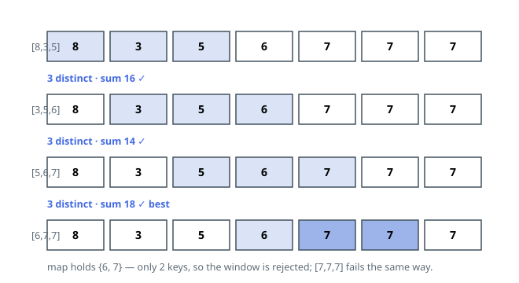

# Solutions — Largest Repeat-Free Window Sum

## Frequency-Map Sliding Window

Every candidate window spans exactly `k` slots, so advancing the window by one
position swaps a single member: the value entering on the right and the value
retiring on the left. Carrying two pieces of state across slides — the running
sum and a dictionary from value to count inside the window — reduces each step
to one insertion, one deletion, and two arithmetic updates.

Repeat-freeness is decided by the dictionary's shape, not by comparisons: a
count that falls to zero is erased immediately, so at any moment the number of
keys equals the number of distinct values present. A window of `k` slots
qualifies exactly when the dictionary holds `k` keys — `k` occupied slots with
`k` distinct values leave no room for a repeat. Scoring starts once the window
has filled (`i >= k - 1`), and only qualifying windows can raise `best`, which
begins at `0` so an input with no valid window — `[6,6,6]` under `k = 3` —
answers `0`.

Boundary bookkeeping decides correctness: from `i >= k` on, the retiring value
is dropped _before_ the window is judged, holding the population at exactly
`k` for every check. Erasing zero-count keys rather than parking stale zeros
is what keeps `len` meaningful, and it incidentally caps the dictionary at
`k + 1` entries at all times.

One sweep with constant amortized work per element is linear overall. Sums
climb as high as `10^5 · 10^5 = 10^{10}`, which Python's integers absorb
natively and which the declared 64-bit return type carries in every language.

**Complexity:** `O(n)` time, `O(k)` space.
