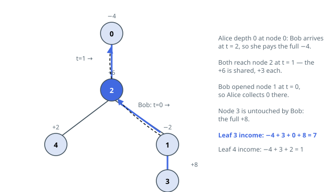

# Solutions — Best Root-to-Leaf Walk Against a Rival

## Arrival Times Against Bob's Fixed Route

Bob's walk is a single fixed path from `bob` up to the root, one edge per
second — so his arrival time at every node along that path can be tabulated
before Alice moves. Alice's timing is just as rigid: leaving the root at
`t = 0` and moving one edge per second, she reaches each node exactly at its
depth. What remains of the task is a three-way comparison at each node:
Bob arrives later or never — Alice banks the full value; the arrivals
coincide — half; Bob got there first — nothing, the value is spent.

A single BFS from the root orients the tree, delivering `parent`, `depth`,
and a queue order in which every node appears after its parent. Bob's
schedule comes from chasing `parent` links up from `bob`, writing
`bob_time[node] = t` on the way. One more sweep over the BFS order then
accumulates `total[u] = total[parent] + gain`, with `gain` implementing the
three-way rule; because a parent is always finalized first, every
root-to-node sum materializes without recursion.

Alice's stopping points are the leaves — nodes other than the root with
exactly one neighbor — since she must keep moving until one is reached. The
answer is the largest `total` among them; the root itself is not a candidate
(it is the start, and its value already entered the accumulation), and the
running maximum can be tracked inside the same sweep.

Three linear passes — orientation, Bob's chain, accumulation — settle
everything. Halving is exact on even values, and floor division treats
negative charges correctly, since an even number floors to its exact half.

**Complexity:** `O(n)` time, `O(n)` space.
