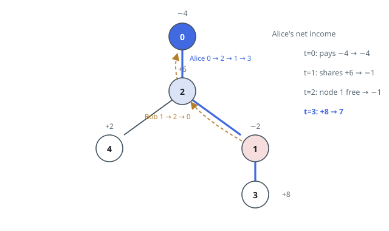
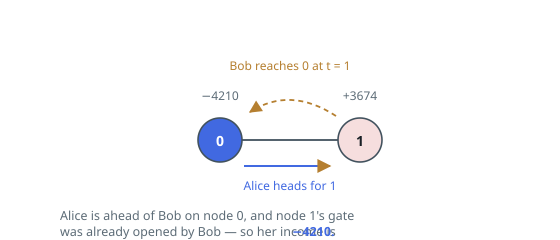

# Best Root-to-Leaf Walk Against a Rival

## Description

An undirected tree with `n` nodes labeled `0` to `n - 1` is rooted at node `0`;
its `n - 1` edges are listed as `edges[i] = [ai, bi]`.

Every node `i` carries an even integer `amount[i]`. Collecting a node adds its
value to the collector's total — a positive value is a reward, a negative one
a charge.

Two walkers advance at the same speed, one edge per second:

- Alice starts at the root and chooses each step for herself, but she must
  keep moving until she reaches a leaf, where she stops.
- Bob starts at node `bob` and has only one route — straight up the tree to
  the root, where he stops.

Whoever reaches a node first collects its value. If both arrive in the same
second, they split it and each takes half — always a whole number, because
every value is even. A node already collected gives nothing to a later
arrival.

Return the largest total Alice can finish with, taken over every leaf she
might walk to.

### Example 1

```text
Input: edges = [[0,2],[2,4],[2,1],[1,3]], bob = 1, amount = [-4,-2,6,8,2]
Output: 7
Explanation:
- At t = 0 Alice stands on the root and pays its −4. Bob stands on node 1 and
  takes its −2.
- At t = 1 both arrive at node 2 simultaneously and split the +6: Alice's
  running total is −4 + 3 = −1.
- At t = 2 Alice reaches node 1, whose value Bob pocketed at t = 0, so she
  gains nothing. Bob reaches the root and stops.
- At t = 3 Alice arrives at leaf 3 and collects its +8, ending at 7.
Walking to leaf 4 instead would have ended at −4 + 3 + 2 = 1.
```



### Example 2

```text
Input: edges = [[0,1]], bob = 1, amount = [-4210,3674]
Output: -4210
Explanation: Alice follows 0 -> 1 while Bob follows 1 -> 0. Alice pays the
full −4210 at the root, and by the time she reaches node 1 its value is long
gone. Her total is −4210.
```



### Example 3

```text
Input: edges = [[0,1],[0,2],[0,3]], bob = 3, amount = [-6,10,12,8]
Output: 6
Explanation: Bob's only route is 3 -> 0. Alice reaches the root before him
and pays the full −6; leaf 3 would hand her nothing, since Bob began his walk
there. Her best walk is to node 2: −6 + 12 = 6.
```

### Constraints

- `2 <= n <= 10⁵`
- `edges.length == n - 1`
- `edges[i].length == 2`
- `0 <= ai, bi < n`
- `ai != bi`
- `edges` describes a valid tree.
- `1 <= bob < n`
- `amount.length == n`
- `amount[i]` is even and lies in `[-10⁴, 10⁴]`.

## Hints

### Hint 1

Bob has no decisions to make, so everything about his walk — in particular
when he passes each node — can be settled before Alice takes a step.

### Hint 2

Alice also has no timing decisions: starting at the root and moving one edge
per second, she arrives at each node exactly at its depth.

### Hint 3

Per node the outcome is a three-way comparison of the two arrival times:
full value, half, or nothing. Push root-to-node totals down the tree in one
sweep and read off the best leaf.
