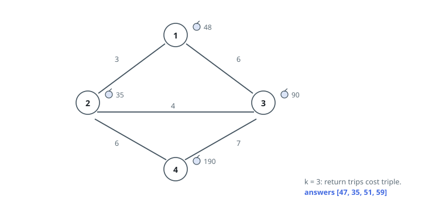
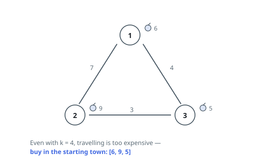

# Cheapest Apple Run From Every Town

## Description

A region has `n` towns numbered `1` to `n`, joined by `roads`, where
`roads[i] = [ai, bi, costi]` describes a two-way road between towns `ai` and
`bi` that costs `costi` to travel in either direction. The 1-based array
`appleCost` gives the price of one apple in each town: `appleCost[i]` is the
price in town `i`.

A run works like this: leave the town you are in, travel any route you like,
buy exactly one apple somewhere, and come back to where you started. Roads
cost their normal price on the way out — but on the way home every road costs
`k` times as much.

Given `k`, return a 1-based array `answer` of length `n`, where `answer[i]`
is the least a run out of town `i` can cost.

### Example 1

```text
Input: n = 4, roads = [[1,2,3],[1,3,6],[2,3,4],[2,4,6],[3,4,7]], appleCost = [48,35,90,190], k = 3
Output: [47,35,51,59]
Explanation:
- From town 1: go 1 -> 2, buy there for 35, return 2 -> 1. That is
  3 + 35 + 3*3 = 47, beating the local price of 48.
- From town 2: buy at home for 35.
- From town 3: go 3 -> 2, buy for 35, return. That is 4 + 35 + 4*3 = 51.
- From town 4: go 4 -> 2, buy for 35, return. That is 6 + 35 + 6*3 = 59.
```



### Example 2

```text
Input: n = 3, roads = [[1,2,7],[2,3,3],[3,1,4]], appleCost = [6,9,5], k = 4
Output: [6,9,5]
Explanation: Every road is dear, and quadrupling it for the trip home only
dears it further — buying in the town you start from is cheapest each time.
```



### Example 3

```text
Input: n = 2, roads = [[1,2,3]], appleCost = [20,8], k = 1
Output: [14,8]
Explanation: With k = 1 the ride home costs the same as the ride out. From
town 1, fetching the cheap apple costs 3 + 8 + 3 = 14, better than the local
20. From town 2, staying put for 8 wins.
```

### Constraints

- `2 <= n <= 1000`
- `1 <= roads.length <= 2000`
- `1 <= ai, bi <= n`
- `ai != bi`
- `1 <= costi <= 10⁵`
- `appleCost.length == n`
- `1 <= appleCost[i] <= 10⁵`
- `1 <= k <= 100`
- No two towns are joined by more than one road.

## Hints

### Hint 1

However you wander on the way to the apple, the cheapest journey sticks to
one route — so a run is decided by a single destination town.

### Hint 2

Write the run's cost in terms of the shortest distance `d` from the start to
the destination: the outbound and homebound legs combine into one factor.

### Hint 3

For each starting town, one Dijkstra pass over the positive road costs gives
every `d` at once; then minimize `appleCost[j] + (k+1)*d[j]`, where the start
itself has `d = 0`.
