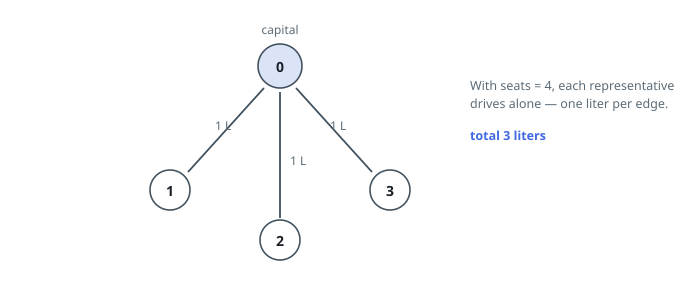
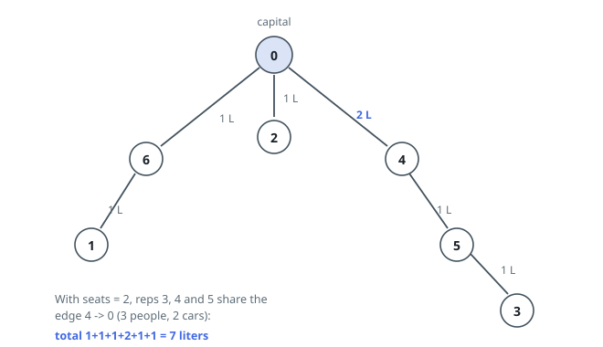

# Carpool Fuel to the Capital

## Description

A country of `n` cities, numbered `0` to `n - 1`, is joined by exactly
`n - 1` two-way roads given as `roads[i] = [ai, bi]` — a connected network
with no loops. City `0` is the capital.

Every city is sending its one representative to a meeting in the capital, and
every city owns exactly one car. Each car has `seats` seats. A representative
may drive their own city's car, ride as a passenger in any car they meet, and
change cars as often as they like. Driving a car from one city to an adjacent
city burns one liter of fuel, no matter how many people are aboard.

Return the least number of liters that gets all `n` representatives to the
capital.

### Example 1

```text
Input: roads = [[0,2],[0,3],[0,1]], seats = 4
Output: 3
Explanation: The capital sits at the center of a three-pointed star, so no
route passes through another city. Even with four seats to offer, nobody has
anyone to pick up: each representative drives in alone, one liter per car.
```



### Example 2

```text
Input: roads = [[0,2],[0,6],[0,4],[6,1],[4,5],[5,3]], seats = 2
Output: 7
Explanation:
- Representative 3 drives 3 -> 5 (1 liter), then shares a car with
  representative 5 to city 4 (1 liter).
- At city 4 the pair meets representative 4; three people with two-seat cars
  need two cars for the hop 4 -> 0 (2 liters).
- Representative 1 drives 1 -> 6 (1 liter) and rides with representative 6
  into the capital (1 liter).
- Representative 2 drives straight in (1 liter).
That totals 1 + 1 + 2 + 1 + 1 + 1 = 7 liters.
```



### Example 3

```text
Input: roads = [], seats = 4
Output: 0
Explanation: The capital is the only city, and its representative is already
there.
```

### Constraints

- `1 <= n <= 10⁵`
- `roads.length == n - 1`
- `roads[i].length == 2`
- `0 <= ai, bi < n`
- `ai != bi`
- `roads` describes a valid tree.
- `1 <= seats <= 10⁵`

## Hints

### Hint 1

Everyone starting in a subtree has no choice but to cross the one edge
leading out of it. What single number per node would tell you how many people
that is?

### Hint 2

With `s` people crossing an edge in cars of `seats` seats, the fewest cars
that can make the crossing is `ceil(s / seats)` — and each car burns a liter.

### Hint 3

Total the liters over every edge, using subtree sizes gathered from the
leaves upward.
