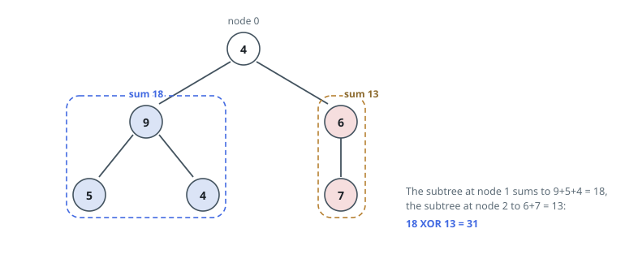
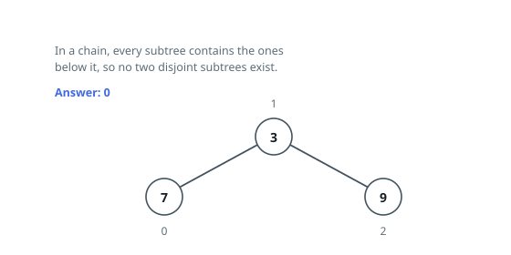

# Largest XOR of Two Disjoint Subtrees

## Description

You are given a tree with `n` nodes numbered `0` through `n - 1` and rooted at
node `0`. The array `edges` has `n - 1` pairs; each pair `[ai, bi]` joins nodes
`ai` and `bi` with an undirected edge. Node `i` carries the value `values[i]`.

The subtree of a node is that node together with every descendant of it. Pick
two subtrees that share no node, add up the values inside each, and combine the
two totals with bitwise XOR. That combined value is your score.

Return the highest score the tree allows. When no two subtrees can be made
node-disjoint, return `0`.

### Example 1

```text
Input: n = 6, edges = [[0,1],[0,2],[1,3],[1,4],[2,5]], values = [4,9,6,5,4,7]
Output: 31
Explanation: The subtree hanging from node 1 totals 9 + 5 + 4 = 18 and the one
hanging from node 2 totals 6 + 7 = 13. They share no node, and 18 XOR 13 = 31.
No other disjoint pair scores higher.
```



### Example 2

```text
Input: n = 3, edges = [[0,1],[1,2]], values = [7,3,9]
Output: 0
Explanation: The tree is one straight path, so every subtree contains the
subtrees further along it. No two of them are disjoint, and the score is 0.
```



### Example 3

```text
Input: n = 6, edges = [[0,1],[0,2],[2,3],[2,4],[4,5]], values = [3,20,4,1,8,7]
Output: 27
Explanation: Both branches off the root total 20, so pitting them against each
other scores 20 XOR 20 = 0. The best pairing is node 1's subtree (sum 20)
against node 4's subtree, which holds 8 + 7 = 15: 20 XOR 15 = 27.
```

### Constraints

- `2 <= n <= 5 * 10⁴`
- `edges.length == n - 1`
- `0 <= ai, bi < n`
- `values.length == n`
- `1 <= values[i] <= 10⁹`
- `edges` describes a valid tree.

## Hints

### Hint 1

Before any pairing, you need the total held under each node. One post-order
sweep computes every subtree sum.

### Hint 2

In a rooted tree, two subtrees intersect exactly when one of their roots is an
ancestor of the other. Restate the pairing rule in those terms.

### Hint 3

During a DFS, drop each subtree's sum into a binary trie at the moment the
subtree is finished. On entering a node, the trie holds precisely the sums that
are legal partners for it — query it for the best XOR before descending.
