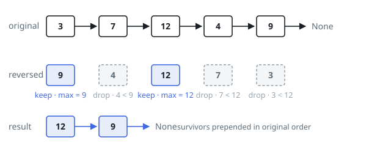

# Solutions — Filter List by Suffix Maximum

## Reverse, Then Keep What Meets the Running Maximum

A node's fate depends solely on the values after it, i.e. on the maximum of
its suffix. Suffix facts are invisible to a forward walk but obvious to a
backward one, so start by turning the list around with the usual
three-pointer reversal. Once reversed, "somewhere later" has become "already
behind us", and each node's test collapses to one comparison against a single
running number.

Walk the reversed list holding `max_seen`, the largest value passed so far —
in the original orientation that is exactly the suffix maximum. When a node's
value is `>= max_seen`, nothing strictly greater lies behind it, so it lives:
raise `max_seen` and link the node onto the front of a fresh result list.
Linking at the front is what restores the original order for free. A node
below `max_seen` is simply never linked in.

The `>=` is deliberate. Equality is not "strictly greater", so a run of
matched values survives together — the all-8 list keeps every node, and in
`[3,7,12,4,9]` the trailing 9 would survive even if a second 9 sat in front
of it. Seeding `max_seen` at negative infinity guarantees the last node of
the original list (the first examined) always passes. Both passes rewire the
existing `next` pointers and nothing more.

**Complexity:** `O(n)` time, `O(1)` extra space.
