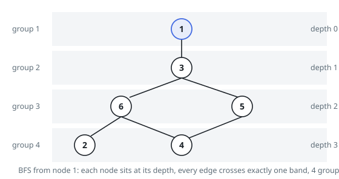

# Solutions — Deepest Valid Grouping of a Graph

## Component-by-Component BFS, Trying Every Root

Pin some node `v` of a connected component into the component's first group.
The adjacency rule then decides everything else: each neighbor of `v` must sit
exactly one group later, each neighbor of those exactly two later, and so on —
every node's group is its BFS distance from `v`, measured in groups. Placing a
node any closer or farther breaks some edge along a shortest path. So the
deepest grouping a component admits is `1 + max over v of the BFS depth from
v`, and since separate components never share an edge, their depths simply
sum.

The implementation carves the graph into components with an iterative DFS
first, gathering each component's nodes. For every candidate root it runs a
BFS, recording distances and the largest distance reached. That same BFS is
the feasibility test: an edge whose endpoints both land at the same distance
exposes an odd cycle — three or more mutually adjacent constraints no sequence
of integers differing by 1 can satisfy — and the answer for the whole input
becomes `-1` on the spot, as with the triangle in Example 3.

Trying every root is required, not redundant: BFS depth from one root can
beat or lose to depth from another, so all nodes of the component are tested
and the best kept, contributing `best + 1` to the total (distances count from
0, groups from 1). For the three disjoint pairs of Example 2, each component
is a single edge whose two roots both reach depth 1, giving `2 + 2 + 2 = 6`.

With `n` capped at 500, running a BFS from each of at most 500 roots over
adjacency lists is comfortably fast even with the 10⁴-edge allowance, and the
guarantees of no duplicate edges and no self-loops keep the parity test honest.

**Complexity:** `O(n(n + m))` time, `O(n + m)` space.
