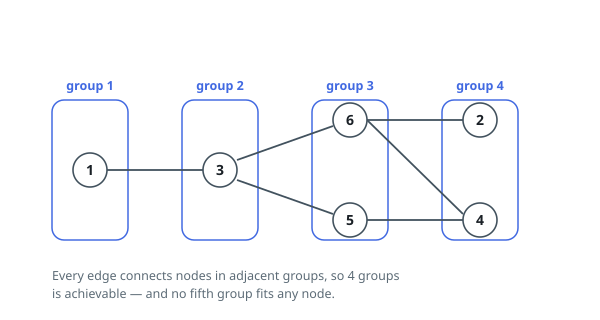

# Deepest Valid Grouping of a Graph

## Description

You are given an undirected graph with `n` nodes numbered `1` to `n`, described
by the array `edges`, where each entry `[u, v]` is a bidirectional link between
nodes `u` and `v`. The graph may split into several disconnected parts.

Split the nodes into numbered groups so that both of these hold:

- every node is placed in exactly one group;
- whenever `[u, v]` is an edge and `u` sits in group `x` while `v` sits in
  group `y`, the two group numbers are adjacent: `|y - x| = 1`.

Return the largest number of groups such a split can use, or `-1` when no
valid split exists at all.

### Example 1

```text
Input: n = 6, edges = [[1,3],[2,6],[3,5],[3,6],[4,5],[4,6]]
Output: 4
Explanation: One valid split uses four groups:
- group 1 holds node 1
- group 2 holds node 3
- group 3 holds nodes 5 and 6
- group 4 holds nodes 2 and 4
Every edge runs between two neighboring groups. Pushing any node into a fifth
group would leave one of the edges stuck inside a single group or jumping two
groups, so 4 is the limit.
```



### Example 2

```text
Input: n = 6, edges = [[1,2],[3,4],[5,6]]
Output: 6
Explanation: The graph falls into three separate pairs. Each pair needs two
adjacent groups, and nothing links the pairs, so their group counts add:
2 + 2 + 2 = 6.
```

### Example 3

```text
Input: n = 5, edges = [[1,2],[2,4],[1,4],[3,5]]
Output: -1
Explanation: Nodes 1, 2 and 4 form a triangle. Three mutually adjacent nodes
would need three group numbers that differ pairwise by exactly 1, which no
integers provide, so no valid grouping exists.
```

### Constraints

- `1 <= n <= 500`
- `1 <= edges.length <= 10⁴`
- `edges[i].length == 2`
- `1 <= u, v <= n`
- `u != v`
- No pair of nodes is joined by more than one edge.

## Hints

### Hint 1

A triangle can never be satisfied, and neither can any other odd cycle: the
group numbers along a cycle must alternate up and down by 1. When is the whole
task hopeless?

### Hint 2

Separate parts of the graph never constrain each other. Handle each connected
component on its own and add the component answers together.

### Hint 3

Within a component, pin some node `v` into the first group. Every neighbor
must land one group later, and so on — each node's group becomes exactly its
BFS distance from `v`. Different choices of `v` give different depths; try
them all and keep the deepest.
