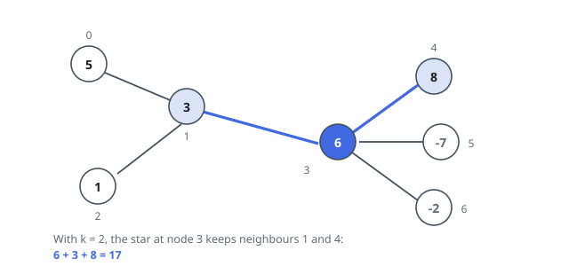
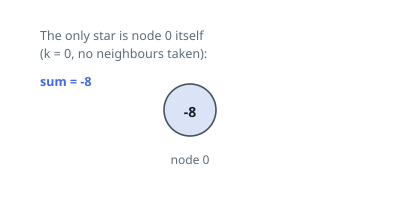

# Largest Star Sum in a Graph

## Description

An undirected graph has `n` nodes numbered `0` to `n - 1`, and node `i` carries
the value `vals[i]`. The array `edges` lists its links: each entry `[u, v]`
joins nodes `u` and `v`.

A **star** is any set of at most `k` edges of this graph that all share one
common endpoint, called the star's center. The star's nodes are the center
together with every endpoint its chosen edges touch. With zero edges chosen,
the star is the center alone.

The star's sum is the total of the values carried by its nodes. Return the
largest sum any star can reach.

### Example 1

```text
Input: vals = [5,3,1,6,8,-7,-2], edges = [[0,1],[1,2],[1,3],[3,4],[3,5],[3,6]], k = 2
Output: 17
Explanation: Center the star at node 3 (value 6) and pick the edges toward
node 4 (value 8) and node 1 (value 3). Two edges are allowed and both chosen
neighbors help, giving 6 + 8 + 3 = 17. No other center does better.
```



### Example 2

```text
Input: vals = [-8], edges = [], k = 0
Output: -8
Explanation: With no edges available and k = 0, the only star is the lone node
itself, so its value is the answer even though it is negative.
```



### Example 3

```text
Input: vals = [2,9,7,-1], edges = [[0,1],[0,2],[0,3]], k = 2
Output: 18
Explanation: Node 0 (value 2) has three neighbors worth 9, 7 and -1, but only
two edges may be used: take 9 and 7 for 2 + 9 + 7 = 18. The -1 neighbor is
never worth an edge, and centers 1 and 2 reach only 11 and 9.
```

### Constraints

- `n == vals.length`
- `1 <= n <= 10⁵`
- `-10⁴ <= vals[i] <= 10⁴`
- `0 <= edges.length <= min(n * (n - 1) / 2, 10⁵)`
- `edges[i].length == 2`
- `0 <= u, v <= n - 1`
- `u != v`
- `0 <= k <= n - 1`

## Hints

### Hint 1

Choosing a star means choosing its center, then deciding which of its incident
edges to keep. Remember the zero-edge option: the center by itself is always
legal.

### Hint 2

Values just add, so for one center the best choice is mechanical — line the
neighbor values up from largest to smallest and take them while the budget `k`
lasts and the values are still positive.

### Hint 3

Run that greedy for every node as center and return the biggest total seen.
