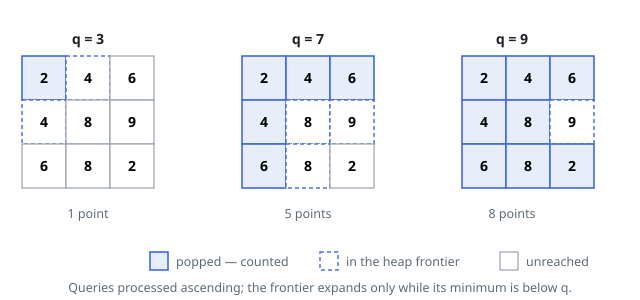

# Solutions — Reachable Grid Cells Per Query

## Ascending Thresholds Over a Min-Heap Frontier

For a threshold `q`, the collected cells are precisely the ones joined to the
corner by a path whose every cell value lies strictly below `q` — the length
of the walk is irrelevant, only connectivity through small values matters.
Raising `q` can only enlarge that set. So instead of restarting a flood fill
for each of the `k` thresholds, sort them ascending (carrying each one's
original index) and let one growing region serve them all: the region for a
small threshold is a subset of the region for a larger one.

The growing region is run Dijkstra-style. A min-heap keyed by cell value holds
the frontier, seeded with the corner cell and marked visited. For the current
threshold `q`, pop while the heap's smallest value is below `q`: every popped
cell contributes one to the count and pushes its unvisited in-bounds
neighbours. Cells therefore enter the region in value order, each is pushed
and popped exactly once across the whole run, and once the heap minimum sits
at or above `q` nothing more can be collected for this or any later
(smaller-indexed-in-value) threshold — write the running count to
`answer[idx]` and move on.

Two details keep it correct. Marking a cell visited at push time rather than
pop time bars duplicate heap entries and caps the heap at the grid size. And a
threshold that fails at the corner — the corner value is at or above it —
scores 0 without any special case: the very first comparison stops the loop,
which is exactly Example 2's situation. In Example 1's grid, the thresholds
3, 7 and 9 land on counts 1, 5 and 8: the 8s and the 9 wall off the interior
until the largest threshold drowns everything but the 9 itself.

**Complexity:** `O(mn log(mn) + k log k)` time, `O(mn)` space.
