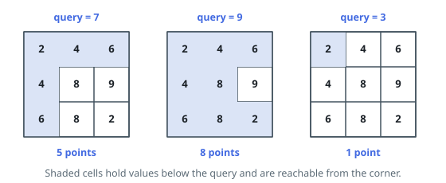
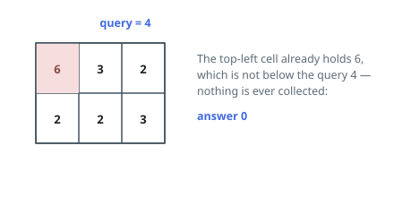

# Reachable Grid Cells Per Query

## Description

You are given an `m x n` integer matrix `grid` and a list `queries` of length
`k`.

Each query is a threshold. For the threshold `queries[i]`, walk the grid
starting from the top-left corner under these rules:

- Standing on a cell whose value is **strictly below** the threshold, you
  collect the cell — it counts once, the first time you step on it — and you
  may step to any of the four orthogonally adjacent cells.
- Standing on a cell whose value is at or above the threshold, you collect
  nothing and the walk is over.

Build `answer`, where `answer[i]` is the largest number of distinct cells a
walk for `queries[i]` can collect. Cells may be crossed many times within one
walk; only distinct cells score.

Return `answer`.

### Example 1

```text
Input: grid = [[2,4,6],[4,8,9],[6,8,2]], queries = [9,3,7]
Output: [8,1,5]
Explanation: At threshold 9 everything except the 9 itself is below the bar,
so eight cells are collected. At threshold 3 the corner's 2 qualifies but
every neighbour is 4 or more, leaving a single cell. At threshold 7 the walk
covers the whole top row plus the two cells under the corner — five cells,
walled in by the 8s and the 9.
```



### Example 2

```text
Input: grid = [[6,3,2],[2,2,3]], queries = [4]
Output: [0]
Explanation: The starting cell holds 6, which already fails a threshold of 4,
so the walk ends before collecting anything.
```



### Example 3

```text
Input: grid = [[1,5],[3,2]], queries = [4,6]
Output: [3,4]
Explanation: Threshold 4 collects 1, 3 and 2 — the low cells wrap around the
ridge of 5. Threshold 6 exceeds every value present, so all four cells fall
to the walk.
```

### Constraints

- `m == grid.length`
- `n == grid[i].length`
- `2 <= m, n <= 1000`
- `4 <= m * n <= 10⁵`
- `k == queries.length`
- `1 <= k <= 10⁴`
- `1 <= grid[i][j], queries[i] <= 10⁶`

## Hints

### Hint 1

Every threshold is known up front, so nothing forces you to process them in
the order given.

### Hint 2

The set of collectible cells can only widen as the threshold rises. Sort the
thresholds — carrying their original positions — and the work of one query
becomes a head start for the next.

### Hint 3

Grow a Dijkstra-style frontier from the corner in order of cell value, popping
while the smallest frontier value sits below the current threshold, and read
the running count off for each threshold in turn.
