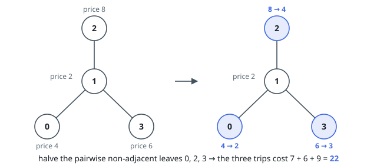

# Cheapest Trips After Halving Node Prices

## Description

You are given a tree with `n` nodes numbered `0` to `n - 1`, described by
`edges`, where `edges[i] = [a, b]` means nodes `a` and `b` are joined by an
edge.

Node `i` carries a price `price[i]`. You must also make a list of trips:
`trips[i] = [start, end]` travels from `start` to `end` along the unique path
connecting them and pays the price of every node that path touches, both
endpoints included.

Before the first trip sets out, you may select a set of nodes no two of which
are directly joined by an edge, and halve the price of each selected node.

Return the smallest total amount payable for all the trips.

### Example 1

```text
Input: n = 4, edges = [[0,1],[1,2],[1,3]], price = [4,2,8,6], trips = [[3,0],[1,2],[3,2]]
Output: 22
Explanation: Halve the prices of nodes 0, 2 and 3, which are pairwise
non-adjacent, to 2, 4 and 3.
- Trip [3,0] follows 3 → 1 → 0 and pays 3 + 2 + 2 = 7.
- Trip [1,2] follows 1 → 2 and pays 2 + 4 = 6.
- Trip [3,2] follows 3 → 1 → 2 and pays 3 + 2 + 4 = 9.
The total is 7 + 6 + 9 = 22, and no other halving choice does better.
```



### Example 2

```text
Input: n = 2, edges = [[0,1]], price = [6,4], trips = [[0,0]]
Output: 3
Explanation: The single trip starts and ends at node 0, so it pays node 0's
price alone. Halving node 0 brings the payment to 3.
```


### Constraints

- `1 <= n <= 50`
- `edges.length == n - 1`
- `0 <= a_i, b_i <= n - 1`
- The given edges form a tree.
- `price.length == n`
- `price[i]` is even.
- `1 <= price[i] <= 1000`
- `1 <= trips.length <= 100`
- `0 <= start_i, end_i <= n - 1`

## Hints

### Hint 1

No trip ever chooses a route — the path is unique — so the undiscounted bill
is `price[i]` times the number of trip paths through node `i`, summed over
nodes. Count those pass-throughs first.

### Hint 2

Halving node `i` saves half its price times its pass-through count, and
halved nodes must be pairwise non-adjacent. What classic tree problem does
that leave?

### Hint 3

Root the tree anywhere and compute two values per node — the best subtree
cost with the node full, and with it halved. A halved node forces every
neighbour full; a full node takes the cheaper of its neighbours' two states.
