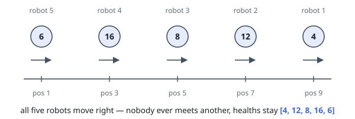
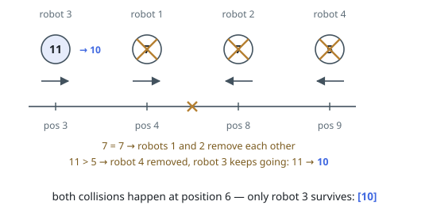
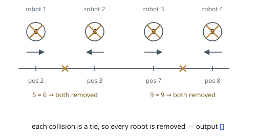

# Line Collision Survivors

## Description

Robots stand on a number line. Robot `i` starts at `positions[i]` with `healths[i]`
health and moves the way `directions[i]` says — `'L'` toward smaller coordinates,
`'R'` toward larger ones. Positions are pairwise distinct and may be listed in
any order.

At a signal, every robot moves off at the same speed. Whenever two robots reach
the same point they collide: the robot with less health is destroyed, and the
winner carries on its own way with one less health. A collision between two
equally healthy robots destroys both.

Return the health of the robots still on the line, in the order the robots were
given. If nothing survives, return an empty array.

### Example 1

```text
Input: positions = [9,7,5,3,1], healths = [4,12,8,16,6], directions = "RRRRR"
Output: [4,12,8,16,6]
Explanation: Every robot travels right, so no two of them can ever meet and all
five keep the health they started with.
```



### Example 2

```text
Input: positions = [4,8,3,9], healths = [7,7,11,5], directions = "RLRL"
Output: [10]
Explanation: Robots 1 and 2 meet with matching health 7, so both are destroyed.
Later robot 3 meets robot 4, whose health is smaller: robot 4 is destroyed and
robot 3 continues with health 11 - 1 = 10. Robot 3 is the only one left.
```



### Example 3

```text
Input: positions = [2,3,7,8], healths = [6,6,9,9], directions = "RLRL"
Output: []
Explanation: Robots 1 and 2 wipe each other out, then robots 3 and 4 do the
same. Nothing is left standing on the line.
```



### Constraints

- `1 <= n == positions.length == healths.length == directions.length <= 10⁵`
- `1 <= positions[i], healths[i] <= 10⁹`
- `directions[i]` is `'L'` or `'R'`
- All values in `positions` are distinct

## Hints

### Hint 1

Nothing can happen to a robot until something moving toward it arrives. Listing
the robots by where they stand puts every meeting in the order it occurs.

### Hint 2

Sweeping across the line in that order, the only robots a newcomer can hit are
right-movers it has already passed — and they behave like a stack.

### Hint 3

Skip the clock entirely: settle each left-mover against the top of that stack,
one duel at a time, until it dies, trades, or runs out of opponents.
