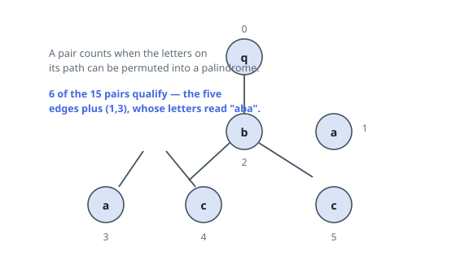

# Tree Paths That Rearrange to Palindromes

## Description

You are given a tree rooted at node `0` whose `n` nodes are numbered `0` to
`n - 1`. The array `parent` describes it: `parent[i]` is the parent of node
`i`, and `parent[0] == -1`.

A string `s` of length `n` puts one letter on each node — think of `s[i]` as
sitting on the edge from `i` up to its parent. `s[0]` is never used.

Count the pairs `(u, v)` with `u < v` for which the letters collected along
the path from `u` to `v` can be rearranged into a palindrome. A palindrome
reads the same in both directions.

### Example 1

```text
Input: parent = [-1,0,0,2,2,1], s = "qabacc"
Output: 6
Explanation: The five edges give the pairs (0,1), (0,2), (2,3), (2,4) and
(1,5) — each of those paths holds a single letter, which is a palindrome on
its own. The sixth pair is (1,3): its path 1 -> 0 -> 2 -> 3 collects the
letters a, b, a, which already read the same both ways. No other pair's
letters can be rearranged into one.
```



### Example 2

```text
Input: parent = [-1,0,1,2,3], s = "ababc"
Output: 5
Explanation: Here the tree is a chain and the qualifying pairs are the
neighbouring ones (0,1), (1,2), (2,3), (3,4), plus (0,3): walking 0 -> 1 ->
2 -> 3 collects b, a, b.
```

### Constraints

- `n == parent.length == s.length`
- `1 <= n <= 10⁵`
- `0 <= parent[i] <= n - 1` for every `i >= 1`
- `parent[0] == -1`, and `parent` describes a tree
- `s` consists of lowercase English letters

## Hints

### Hint 1

A multiset of letters can be shuffled into a palindrome exactly when at most
one letter occurs an odd number of times — so only parities matter.

### Hint 2

Encode each letter as a bit and let mask[v] be the XOR of the letters on the
path from the root down to `v`.

### Hint 3

The shared stretch above the meeting point of `u` and `v` appears in both
masks and cancels: the pair counts exactly when mask[u] XOR mask[v] keeps at
most one bit set.
