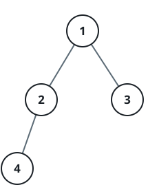
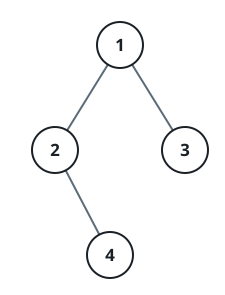

# Binary Tree Bracket Encoding

## Description

Encode a binary tree into a single string by walking it in preorder — a
node's own value, then its left subtree, then its right subtree — and
wrapping each non-empty child's contribution in one pair of parentheses.

Two rules keep the encoding compact and reversible:

**Skip empty pairs.** A child that does not exist contributes no
parentheses at all, so a leaf's value stands alone and a node with only a
left child writes just one bracketed group.

**Except when only the right child exists.** Omitting an empty left
group there would make a right-only child look identical to a left-only
one, so in that single case an empty `()` is written before the right
child's group to keep the encoding unambiguous.

Return the finished string for the given `root`.

### Example 1



```text
Input: root = [1,2,3,4]
Output: "1(2(4))(3)"
Explanation: Written in full every group would appear — "1(2(4)())(3()())"
— but the two trailing empty pairs are dropped, leaving "1(2(4))(3)".
```

### Example 2



```text
Input: root = [1,2,3,null,4]
Output: "1(2()(4))(3)"
Explanation: Node 2 has no left child but does have a right one, so the
"()" placeholder before "(4)" is required to mark the missing left slot.
```

### Constraints

- The number of nodes in the tree is in the range `[1, 10⁴]`.
- `-1000 <= Node.val <= 1000`
