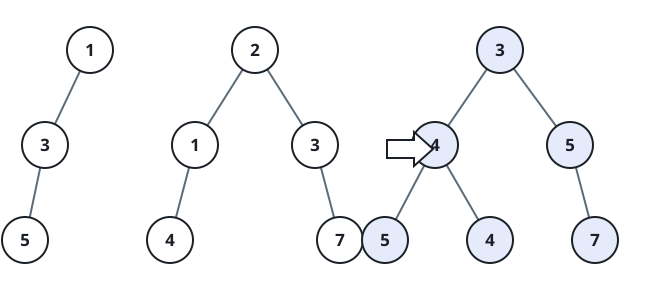

# Overlay Binary Trees

## Description

Two binary trees are placed on top of one another, aligned at their roots.
Build the resulting tree position by position: whenever both inputs contain a
node at the same position, the result receives the sum of their values. If
only one input supplies a node, that node and its entire subtree remain in the
result at that position.

Return the overlaid tree. The alignment always begins with `root1` and
`root2`.

### Example 1



```text
Input: root1 = [1,3,2,5], root2 = [2,1,3,null,4,null,7]
Output: [3,4,5,5,4,null,7]
```

### Example 2

```text
Input: root1 = [1], root2 = [1,2]
Output: [2,2]
```

### Constraints

- The number of nodes in both trees is in the range `[0, 2000]`.
- `-10⁴ <= Node.val <= 10⁴`
