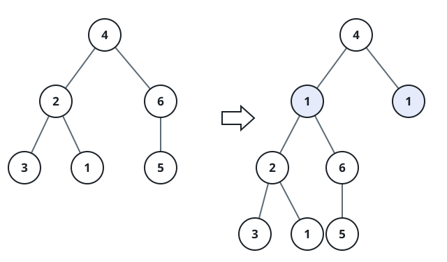
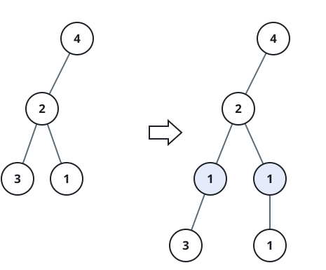

# Insert Row of Nodes at Depth

## Description

Given a binary tree `root` and integers `val` and `depth`, insert a complete
new row of nodes carrying `val` at the requested depth. The root starts at
depth `1`.

For every non-null node `cur` at depth `depth - 1`, create a new left and a
new right child with value `val`. Move `cur`'s previous left subtree beneath
the new left child's left pointer, and move its previous right subtree beneath
the new right child's right pointer. The remaining new child pointers are
empty.

When `depth == 1`, create a new root containing `val` and attach the entire
original tree as its left subtree. Return the modified tree.

### Example 1



```text
Input: root = [4,2,6,3,1,5], val = 1, depth = 2
Output: [4,1,1,2,null,null,6,3,1,5]
```

### Example 2



```text
Input: root = [4,2,null,3,1], val = 1, depth = 3
Output: [4,2,null,1,1,3,null,null,1]
```

### Constraints

- The number of nodes in the tree is in the range `[1, 10⁴]`.
- The depth of the tree is in the range `[1, 10⁴]`.
- `-100 <= Node.val <= 100`
- `-10⁵ <= val <= 10⁵`
- `1 <= depth <=` the depth of the tree `+ 1`
