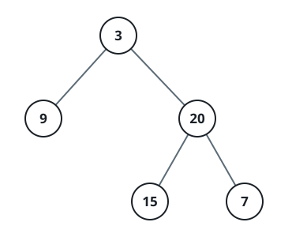
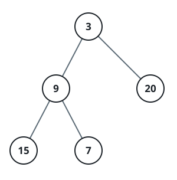

# Binary Tree Level Averages

## Description

Given the `root` node of a binary tree, compute one average for every depth:
the mean of all node values at that depth. Return these averages from the
root level down to the deepest occupied level.

An answer within `10⁻⁵` of the exact value is accepted.

### Example 1



```text
Input: root = [3,9,20,null,null,15,7]
Output: [3.00000,14.50000,11.00000]
Explanation: Depth 0 contains 3, depth 1 contains 9 and 20, and depth 2
contains 15 and 7. Their averages are 3, 14.5, and 11 respectively.
```

### Example 2



```text
Input: root = [3,9,20,15,7]
Output: [3.00000,14.50000,11.00000]
```

### Constraints

- The tree contains between `1` and `10⁴` nodes, inclusive.
- `-2³¹ <= Node.val <= 2³¹ - 1`

## Hints

### Hint 1

All nodes at the same depth should contribute to exactly one result entry,
so process the tree one depth at a time rather than trying to average
subtrees independently.

### Hint 2

A breadth-first queue naturally groups nodes by depth. Before taking nodes
out for a round, record how many are already in the queue — that number is
the full current level.

### Hint 3

Sum exactly those recorded nodes, append their sum divided by the recorded
count, and leave any children added during the round for the next level.
