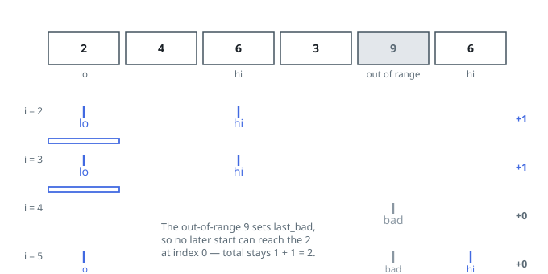

# Solutions — Count Subarrays With Given Extremes

## Sliding window with last-occurrence markers

Charge each qualifying run to its right end. A run ending at `i` qualifies
exactly when it contains at least one `lo`, at least one `hi`, and nothing
outside `[lo, hi]`. All three demands compress into three indices carried
through one left-to-right sweep: `last_bad` is the most recent position of an
out-of-range element (every qualifying run must start after it), while
`last_min` and `last_max` are the most recent positions of the values `lo`
and `hi`.

For the right end `i`, a start `s` produces a qualifying run precisely when
`s > last_bad` and `s <= min(last_min, last_max)`: starting at or before the
later of the two marker occurrences puts both extremes on board, and
starting after every wall keeps the range clean. The count of legal starts is
therefore `min(last_min, last_max) - last_bad`, clamped at zero, and summing
it over every `i` charges each run to exactly one right end.

The subtle point is why only the _latest_ occurrences matter. Extending the
window rightward only moves markers forward, and a start that includes the
latest `lo` and the latest `hi` automatically includes every earlier
occurrence of both. The `max(0, ...)` clamp covers prefixes where one extreme
has yet to appear (its marker still `-1`) or where a wall sits after both
markers, leaving no legal start at this right end.

Each element updates the markers in constant time and contributes one term,
so one pass settles everything. The total can approach `n^2/2` (about
`5·10^9` under the bounds), which Python integers absorb natively.

**Complexity:** `O(n)` time, `O(1)` space.
