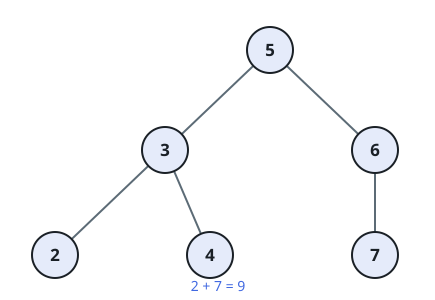
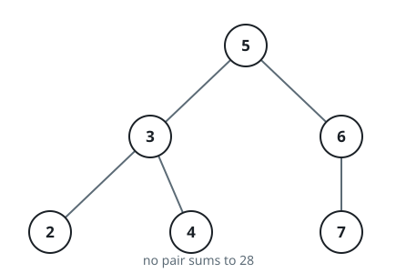

# BST Pair Sum

## Description

You are given the `root` of a binary search tree along with an integer
`k`. Determine whether two distinct nodes in the tree hold values that add
up to exactly `k`, and return `true` if such a pair exists or `false`
otherwise.

### Example 1



```text
Input: root = [5,3,6,2,4,null,7], k = 9
Output: true
```

### Example 2



```text
Input: root = [5,3,6,2,4,null,7], k = 28
Output: false
```

### Constraints

- The tree holds between `1` and `10⁴` nodes.
- Every node value satisfies `-10⁴ <= Node.val <= 10⁴`.
- `root` is always a valid binary search tree.
- `-10⁵ <= k <= 10⁵`
