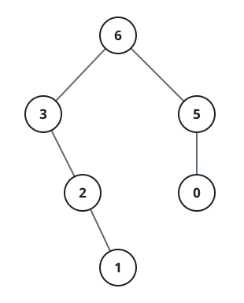
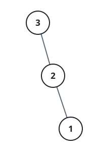

# Peak-Rooted Tree

## Description

You are given an integer array `nums` with no duplicate values. Build a
binary tree from `nums` using this recursive rule:

1. The root of the (sub)tree holds the largest value present in the
   current slice of `nums`.
2. The left subtree is built the same way from the portion of the slice
   that sits before that largest value.
3. The right subtree is built the same way from the portion that sits
   after it.

Return the root of the tree built from the whole of `nums`.

### Example 1



```text
Input: nums = [3,2,1,6,0,5]
Output: [6,3,5,null,2,0,null,null,1]
Explanation: The recursive calls unfold as follows:
- The largest value in [3,2,1,6,0,5] is 6, splitting the slice into the
  left portion [3,2,1] and the right portion [0,5].
    - The largest value in [3,2,1] is 3, splitting into [] on the left
      and [2,1] on the right.
        - An empty slice contributes no child.
        - The largest value in [2,1] is 2, splitting into [] on the left
          and [1] on the right.
            - An empty slice contributes no child.
            - A single-element slice becomes a leaf holding 1.
    - The largest value in [0,5] is 5, splitting into [0] on the left and
      [] on the right.
        - A single-element slice becomes a leaf holding 0.
        - An empty slice contributes no child.
```

### Example 2



```text
Input: nums = [3,2,1]
Output: [3,null,2,null,1]
```

### Constraints

- `1 <= nums.length <= 1000`
- `0 <= nums[i] <= 1000`
- Every value in `nums` is distinct.
