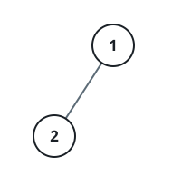
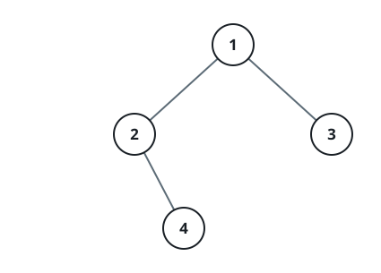

# Tree Layout Grid

## Description

Given the `root` of a binary tree, build a 0-indexed `m x n` string matrix
`res` that draws a formatted picture of the tree, following these rules:

- Let `height` be the tree's height. The matrix has `m = height + 1` rows.
- The matrix has `n = 2^(height + 1) - 1` columns.
- The root goes in the exact middle of the top row, at
  `res[0][(n - 1) / 2]`.
- For a node already placed at `res[r][c]`, its left child goes at
  `res[r + 1][c - 2^(height - r - 1)]` and its right child goes at
  `res[r + 1][c + 2^(height - r - 1)]`.
- Repeat this placement until every node in the tree has a cell.
- Every cell that no node claims holds the empty string `""`.

Return the finished matrix `res`.

### Example 1



```text
Input: root = [1,2]
Output:
[["","1",""],
 ["2","",""]]
```

### Example 2



```text
Input: root = [1,2,3,null,4]
Output:
[["","","","1","","",""],
 ["","2","","","","3",""],
 ["","","4","","","",""]]
```

### Constraints

- The tree holds between `1` and `2¹⁰` nodes.
- Every node value satisfies `-99 <= Node.val <= 99`.
- The tree's depth is between `1` and `10`.
