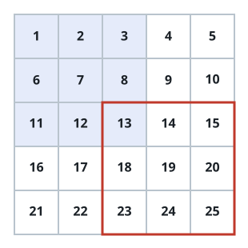
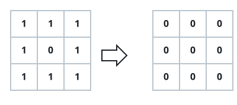
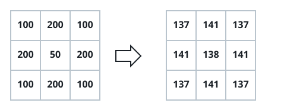

# Grid Blur

## Description

A grid blur is a 3x3 filter applied to every cell of a grayscale image: each
cell becomes the floor of the average of itself and its eight neighbors.
Neighbors that fall outside the grid simply don't count — the average is
taken only over whichever of the nine cells actually exist.



Given an `m x n` integer matrix `img` holding the grayscale values of an
image, return the grid after this blur has been applied to every cell.

### Example 1



```text
Input: img = [[1,1,1],[1,0,1],[1,1,1]]
Output: [[0,0,0],[0,0,0],[0,0,0]]
Explanation:
The four corners (0,0), (0,2), (2,0), (2,2) each average 4 neighbors: floor(3/4) = 0.
The four edges (0,1), (1,0), (1,2), (2,1) each average 6 neighbors: floor(5/6) = 0.
The center (1,1) averages all 9 cells: floor(8/9) = 0.
```

### Example 2



```text
Input: img = [[100,200,100],[200,50,200],[100,200,100]]
Output: [[137,141,137],[141,138,141],[137,141,137]]
Explanation:
The four corners average 4 neighbors: floor((100+200+200+50)/4) = floor(137.5) = 137.
The four edges average 6 neighbors: floor((200+200+50+200+100+100)/6) = floor(141.666667) = 141.
The center averages all 9 cells: floor((50+200+200+200+200+100+100+100+100)/9) = floor(138.888889) = 138.
```

### Constraints

- `m == img.length`
- `n == img[i].length`
- `1 <= m, n <= 200`
- `0 <= img[i][j] <= 255`
