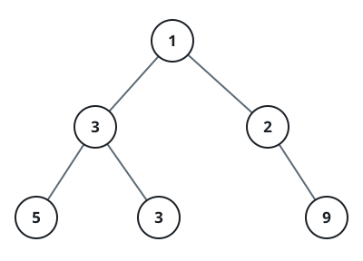
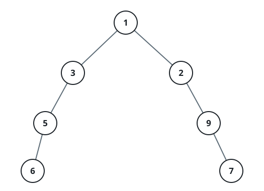
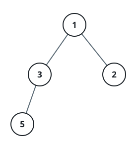

# Binary Tree Span

## Description

Given the `root` of a binary tree, return its widest level's span.

Picture the tree drawn out one level at a time. A level's span is the
distance between its leftmost and rightmost _present_ nodes, counted as if
every null slot in between — the gaps a complete binary tree extending down
to that level would have — were still there. The answer is the largest span
over all levels of the tree.

It is guaranteed that the answer fits in a 32-bit signed integer.

### Example 1



```text
Input: root = [1,3,2,5,3,null,9]
Output: 4
Explanation: The widest level is the third, spanning 4 slots (5,3,null,9).
```

### Example 2



```text
Input: root = [1,3,2,5,null,null,9,6,null,7]
Output: 7
Explanation: The widest level is the fourth, spanning 7 slots (6,null,null,null,null,null,7).
```

### Example 3



```text
Input: root = [1,3,2,5]
Output: 2
Explanation: The widest level is the second, spanning 2 slots (3,2).
```

### Constraints

- The number of nodes in the tree is in the range `[1, 3000]`.
- `-100 <= Node.val <= 100`
