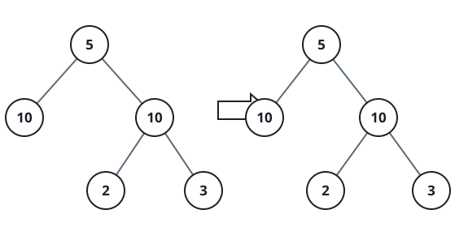
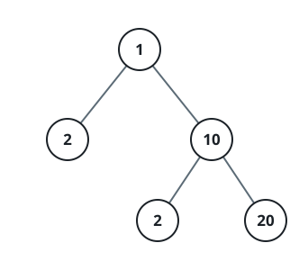

# Balanced Edge Cut

## Description

Given the `root` of a binary tree, determine whether a single edge can be cut
so that the two resulting pieces — the detached subtree and everything left
behind — have equal sums of node values.

Return `true` if some one-edge cut balances the tree this way, `false`
otherwise.

### Example 1



```text
Input: root = [5,10,10,null,null,2,3]
Output: true
```

### Example 2



```text
Input: root = [1,2,10,null,null,2,20]
Output: false
Explanation: No single edge, once cut, leaves two pieces with equal sums.
```

### Constraints

- The number of nodes in the tree is in the range `[1, 10⁴]`.
- `-10⁵ <= Node.val <= 10⁵`.
