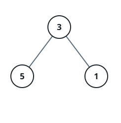
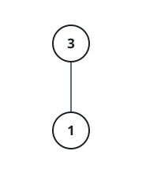

# Encoded Path Sum IV

## Description

A binary tree with depth under 5 can be packed into a flat array of
three-digit codes instead of linked nodes. You are given such an array
`nums`, sorted in ascending order, where each three-digit integer encodes one
node:

- The hundreds digit is the node's depth `d`, `1 <= d <= 4`.
- The tens digit is the node's position `p` within its level, `1 <= p <= 8`,
  numbered as it would sit in a full binary tree.
- The units digit is the node's value `v`, `0 <= v <= 9`.

Decode the tree and return the sum, over every root-to-leaf path, of the
values along that path.

It is guaranteed that `nums` encodes a valid, connected binary tree.

### Example 1



```text
Input: nums = [113,215,221]
Output: 12
Explanation: The encoded tree is shown in the diagram.
The path sum is (3 + 5) + (3 + 1) = 12.
```

### Example 2



```text
Input: nums = [113,221]
Output: 4
Explanation: The encoded tree is shown in the diagram.
The path sum is (3 + 1) = 4.
```

### Constraints

- `1 <= nums.length <= 15`
- `110 <= nums[i] <= 489`
- `nums` represents a valid binary tree with depth less than 5.
- `nums` is sorted in ascending order.
