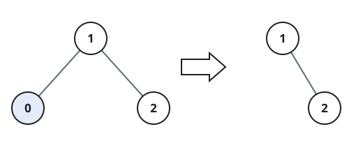
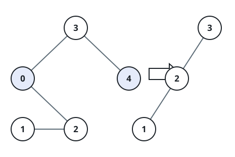

# Prune Search Tree to Bounds

## Description

You are given the `root` of a binary search tree together with a lower bound
`low` and an upper bound `high`. Prune the tree so that only nodes whose
values fall inside `[low, high]` remain, without disturbing the relative
structure of whatever survives — every node that stays must keep exactly the
descendants it originally had among the other surviving nodes. Under these
rules the pruned shape is forced: there is only one tree that satisfies them.

Return the root of the pruned tree. The root itself may need to be replaced
if the original root's value falls outside `[low, high]`.

### Example 1



```text
Input: root = [1,0,2], low = 1, high = 2
Output: [1,null,2]
```

### Example 2



```text
Input: root = [3,0,4,null,2,null,null,1], low = 1, high = 3
Output: [3,2,null,1]
```

### Constraints

- The number of nodes in the tree is in the range `[1, 10⁴]`.
- `0 <= Node.val <= 10⁴`
- The value of each node in the tree is unique.
- `root` is guaranteed to be a valid binary search tree.
- `0 <= low <= high <= 10⁴`
