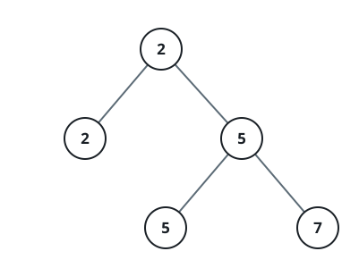
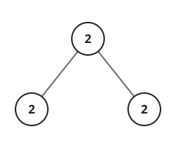

# Second Smallest Value in a Special Tree

## Description

A special binary tree stores only non-negative values, and every node in it
has either exactly two children or none at all. Whenever a node has two
children, that node's own value equals the smaller of its two children's
values — formally, `root.val == min(root.left.val, root.right.val)` holds at
every internal node.

Given the root of such a tree, report the second-smallest value among all of
its node values, taken as a set. If every node shares the same value — so no
second-smallest exists — report `-1` instead.

### Example 1



```text
Input: root = [2,2,5,null,null,5,7]
Output: 5
Explanation: The tree's smallest value is 2; the smallest value strictly
above it is 5.
```

### Example 2



```text
Input: root = [2,2,2]
Output: -1
Explanation: Every node holds 2, so no second-smallest value exists.
```

### Constraints

- The number of nodes in the tree is in the range `[1, 25]`.
- `1 <= Node.val <= 2³¹ - 1`
- `root.val == min(root.left.val, root.right.val)` for each internal node of
  the tree.
