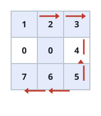
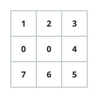

# Fairway Tree Felling

## Description

A golf course crew needs to clear every tree standing on a wooded lot
before construction of a new fairway can begin. The lot is given as an
`m x n` grid `forest`, where each cell means one of three things:

- `0` — the cell is blocked and cannot be entered.
- `1` — the cell is open ground with no tree.
- any value greater than `1` — the cell holds a tree, and the value is
  that tree's height.

The crew starts at cell `(0, 0)` and can move one cell at a time in any
of the four compass directions. Stepping onto a tree's cell lets the
crew choose to fell it there; felling a tree turns its cell into open
ground (value `1`) for every step afterward.

Course rules require the trees to come down in strict order from
shortest to tallest — the crew cannot skip ahead to a taller tree first.
Report the fewest total steps needed to fell every tree on the lot,
walking from `(0, 0)` and taking each tree in that height order. If some
tree can never be reached in its turn, report `-1` instead.

You may assume every tree on the lot has a distinct height, and the lot
always contains at least one tree to fell.

### Example 1



```text
Input: forest = [[1,2,3],[0,0,4],[7,6,5]]
Output: 6
Explanation: Walking the route shown above visits every tree from
shortest to tallest in 6 total steps.
```

### Example 2



```text
Input: forest = [[1,2,3],[0,0,0],[7,6,5]]
Output: -1
Explanation: The middle row is entirely blocked, so the bottom-row
trees can never be reached no matter which order they are felled in.
```

### Example 3

```text
Input: forest = [[1,2,3],[4,0,5],[6,7,8]]
Output: 14
Explanation: The trees, shortest to tallest, sit at (0,1), (0,2), (1,0),
(1,2), (2,0), (2,1), (2,2). Walking from (0,0) through that order along
the only open cells (the center is blocked) costs 14 steps in total.
```

### Constraints

- `m == forest.length`
- `n == forest[i].length`
- `1 <= m, n <= 50`
- `0 <= forest[i][j] <= 10⁹`
- Every tree height on the lot is distinct.
