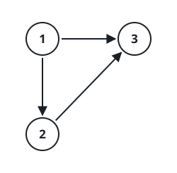
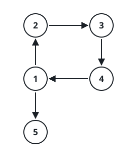

# Repair the Broken Rooted Tree II

## Description

A _rooted directed tree_ on `n` labeled nodes (values `1` through `n`)
has exactly one node with no incoming edge — the root — and every other
node has exactly one incoming edge, from its parent.

You are handed such a tree after someone bolted on one extra directed
edge: `edges` lists `n` directed edges in total, where `edges[i] = [ui,
vi]` means node `ui` points to node `vi`. Exactly one of these `n` edges
is the intruder — it was added to an otherwise-valid rooted tree,
joining two vertices that had no edge between them before, and it was
not already present.

Find one edge whose removal turns the remaining `n - 1` edges back into
a rooted tree over all `n` nodes. When several edges would each work on
their own, report the one that appears latest in `edges`.

### Example 1



```text
Input: edges = [[1,2],[1,3],[2,3]]
Output: [2,3]
```

Node `3` receives an incoming edge from both `1` and `2`, so it has two
parents. Dropping `[2,3]` leaves `1` as the sole parent of both `2` and
`3` — a valid rooted tree — so that later-occurring edge is reported.

### Example 2



```text
Input: edges = [[1,2],[2,3],[3,4],[4,1],[1,5]]
Output: [4,1]
```

Here every node keeps exactly one parent, but `1 -> 2 -> 3 -> 4 -> 1`
closes a cycle. Deleting `[4,1]` breaks the cycle and leaves a valid
rooted tree with `1` at the root and `5` hanging off it.

### Constraints

- `n` equals `edges.length`, with `3 <= n <= 1000`.
- Each `edges[i]` has exactly two entries.
- Vertex labels satisfy `1 <= ui, vi <= n`.
- An edge never loops back on itself: `ui != vi`.
