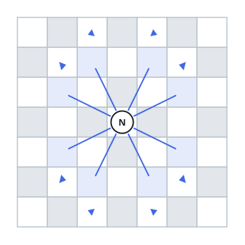

# Knight Survival Probability

## Description

A knight sits at cell `(row, column)` on an `n x n` chessboard and is
about to attempt exactly `k` moves. Rows and columns are 0-indexed, so
`(0, 0)` is the top-left cell and `(n - 1, n - 1)` is the bottom-right.

The knight moves the usual chess way — two cells along one axis, then
one cell along the other — and has eight such moves available from any
square, as shown below.



Before each move the knight picks uniformly at random among the eight
possible moves, even if that choice would carry it off the board. It
keeps moving until it has made `k` moves in total or has stepped off
the board, whichever happens first.

Return the probability that the knight is still on the board once it
stops.

### Example 1

```text
Input: n = 4, k = 1, row = 0, column = 0
Output: 0.25000
Explanation: From the corner (0, 0), only the moves to (1, 2) and
(2, 1) land on the 4x4 board — two of the eight equally likely moves,
giving probability 0.25.
```

### Example 2

```text
Input: n = 1, k = 3, row = 0, column = 0
Output: 0.00000
```

On a `1 x 1` board every one of the eight moves steps off the single
square, so the knight is guaranteed to leave on its first move and the
survival probability is `0`.

### Constraints

- `1 <= n <= 25`
- `0 <= k <= 100`
- `0 <= row, column <= n - 1`
