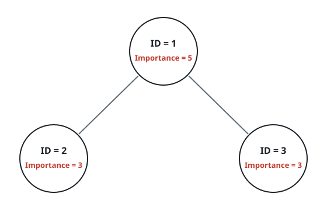
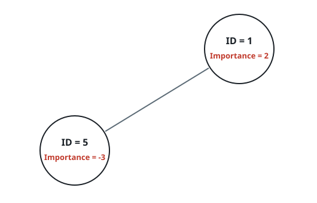

# Team Weight Total

## Description

Each record in `employees` describes one member of an organization:

- `employees[i].id` is that member's unique identifier.
- `employees[i].importance` is the member's signed weight.
- `employees[i].subordinates` lists the IDs of their direct reports.

Given an identifier `id`, add the weights of that member and every
member below them, including both direct reports and reports further
down the reporting structure. Return the resulting total.

### Example 1



```text
Input: employees = [[1,5,[2,3]],[2,3,[]],[3,3,[]]], id = 1
Output: 11
Explanation: Member 1 has weight 5 and directly leads members 2 and 3.
Their weights are 3 and 3, so the requested team total is 5 + 3 + 3 = 11.
```

### Example 2



```text
Input: employees = [[1,2,[5]],[5,-3,[]]], id = 5
Output: -3
Explanation: Member 5 has no reports, so their own weight is the whole
team total. A total may be negative.
```

### Constraints

- `1 <= employees.length <= 2000`
- `1 <= employees[i].id <= 2000`, and all employee IDs are unique.
- `-100 <= employees[i].importance <= 100`
- Each member has at most one direct leader and may have multiple reports.
- Every ID listed in `employees[i].subordinates` identifies a valid member.
