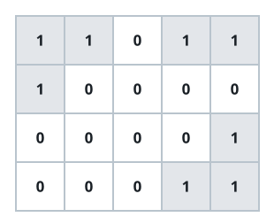

# Unique Island Shapes

## Description

You are given an `m x n` grid of `0`s and `1`s. A `1` marks land, and an
island is a maximal group of land cells connected up, down, left, or
right; water surrounds the grid on all four sides.

Two islands count as the same shape when sliding one — with no rotation
and no mirroring — lands it exactly on top of the other. Return the
number of distinct island shapes in `grid`.

### Example 1


```text
Input: grid = [[1,1,0,0,0],[1,1,0,0,0],[0,0,0,1,1],[0,0,0,1,1]]
Output: 1
Explanation: Both islands are 2x2 squares. Sliding either one onto the
other's position makes them coincide exactly, so they count as a single
shape.
```

### Example 2



```text
Input: grid = [[1,1,0,1,1],[1,0,0,0,0],[0,0,0,0,1],[1,1,0,1,1]]
Output: 3
Explanation: The grid holds four islands. The two 1x2 horizontal pairs
slide onto each other and count as one shape, while the two three-cell
L-shapes bend in different directions and stay distinct, giving three
shapes in total.
```

### Constraints

- `m == grid.length`
- `n == grid[i].length`
- `1 <= m, n <= 50`
- `grid[i][j]` is either `0` or `1`.
