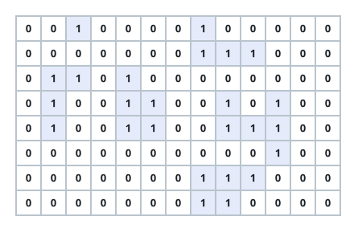

# Largest Island Area

## Description

You are given an `m x n` grid of `0`s and `1`s. A `1` marks land, and an
island is a maximal group of land cells connected up, down, left, or
right; water surrounds the grid on all four sides.

An island's area is its number of land cells. Return the largest island
area found in `grid`, or `0` if the grid holds no land at all.

### Example 1



```text
Input: grid = [[0,0,1,0,0,0,0,1,0,0,0,0,0],[0,0,0,0,0,0,0,1,1,1,0,0,0],[0,1,1,0,1,0,0,0,0,0,0,0,0],[0,1,0,0,1,1,0,0,1,0,1,0,0],[0,1,0,0,1,1,0,0,1,1,1,0,0],[0,0,0,0,0,0,0,0,0,0,1,0,0],[0,0,0,0,0,0,0,1,1,1,0,0,0],[0,0,0,0,0,0,0,1,1,0,0,0,0]]
Output: 6
Explanation: The largest connected patch of land covers six cells. A
nearby cluster contains eleven land cells in all, but two of its pieces
touch only at a corner — a diagonal touch never joins land — so no single
island there has area eleven.
```

### Example 2

```text
Input: grid = [[1,1,0],[1,0,0],[0,0,1]]
Output: 3
Explanation: The top-left three cells connect into one island. The
bottom-right cell touches no land 4-directionally, so it forms its own
island of area one, and the larger island wins.
```

### Constraints

- `m == grid.length`
- `n == grid[i].length`
- `1 <= m, n <= 50`
- `grid[i][j]` is either `0` or `1`.
