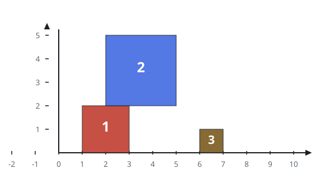

# Stacked Square Drops

## Description

Squares are dropped one at a time onto the X-axis of a 2D plane. You are
given a 2D integer array `positions`, where `positions[i] = [left_i,
side_i]` gives the `i`-th square's side length `side_i` and the
X-coordinate `left_i` of its left edge at the moment it is dropped.

Each square falls straight down from far above anything already on the
ground until its bottom edge meets either the X-axis or the top of some
square already at rest beneath it — touching only the left or right edge of
another square does not count as landing on it. The square then freezes in
place permanently.

After each drop, record the height of the tallest column formed by any of
the squares dropped so far. Return an array `ans` where `ans[i]` is that
tallest-column height immediately after the `i`-th square lands.

### Example 1



```text
Input: positions = [[1,2],[2,3],[6,1]]
Output: [2,5,5]
Explanation:
The first square rests on the axis and stands 2 tall, so the tallest column
is 2.
The second square's footprint overlaps the first, so it lands on top of it
and reaches height 5 (2 + 3), making 5 the new tallest column.
The third square lands alone on the axis at height 1, well short of the
existing tallest column, so the tallest column stays 5.
Thus ans = [2, 5, 5].
```

### Example 2

```text
Input: positions = [[50,50],[60,20],[120,40]]
Output: [50,70,70]
Explanation:
The first square lands on the axis at height 50.
The second square's footprint (from 60 to 80) overlaps the first's (from 50
to 100), so it lands on top of it and reaches 50 + 20 = 70, the new tallest
column.
The third square's footprint (from 120 to 160) does not touch either earlier
square, so it lands alone at height 40 and the tallest column stays 70.
Thus ans = [50, 70, 70].
```

### Constraints

- `1 <= positions.length <= 1000`
- `1 <= left_i <= 10⁸`
- `1 <= side_i <= 10⁶`

## Hints

### Hint 1

Only the relative ordering of the edges matters — `[[30,10],[40,10]]`
behaves exactly like `[[3,1],[4,1]]`. The coordinates given can be as large
as `10⁸`; how could you shrink them down to a workable range first?
