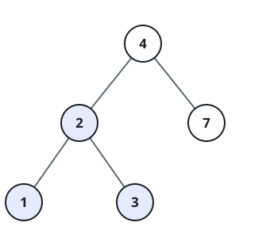
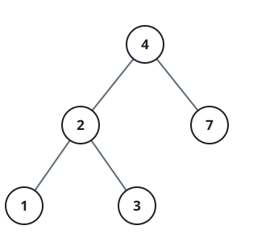

# BST Node Lookup

## Description

You are given the `root` of a binary search tree and an integer `val`.
Walk the tree to find the node whose value equals `val`, and return the
subtree rooted at that node — the node together with everything beneath it.
If no node holds `val`, return `null`.

### Example 1



```text
Input: root = [4,2,7,1,3], val = 2
Output: [2,1,3]
```

### Example 2



```text
Input: root = [4,2,7,1,3], val = 5
Output: []
```

### Constraints

- The tree holds between `1` and `5000` nodes.
- `1 <= Node.val <= 10⁷`
- `root` is a valid binary search tree.
- `1 <= val <= 10⁷`
