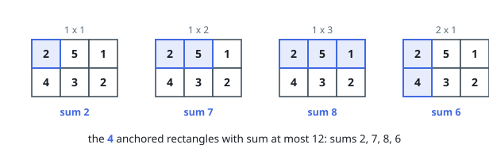
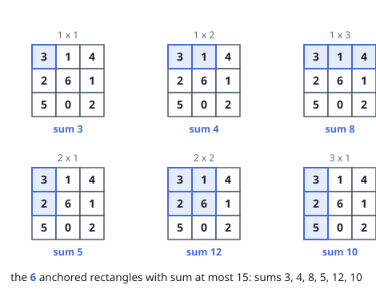

# Count Anchored Submatrices Within a Budget

## Description

You are given an integer matrix `grid` and an integer `k`.

A submatrix of `grid` is anchored when it includes the top-left cell
`grid[0][0]`. Each anchored submatrix is a rectangle that starts at the
top-left corner and extends some number of rows and columns downward and
rightward.

Count the anchored submatrices whose sum of entries is at most `k`.

### Example 1

```text
Input: grid = [[2,5,1],[4,3,2]], k = 12
Output: 4
Explanation: Four anchored rectangles stay within the budget, of sizes 1x1,
1x2, 1x3, and 2x1, with sums 2, 7, 8, and 6. The two larger ones — the 2x2
(sum 14) and the whole grid (sum 17) — both overshoot 12.
```



### Example 2

```text
Input: grid = [[3,1,4],[2,6,1],[5,0,2]], k = 15
Output: 6
Explanation: Six anchored rectangles qualify, of sizes 1x1, 1x2, 1x3, 2x1,
2x2, and 3x1, with sums 3, 4, 8, 5, 12, and 10. Extending any of them one
step further right or down pushes past 15.
```



### Example 3

```text
Input: grid = [[6,1],[1,1]], k = 8
Output: 3
Explanation: The 1x1 (sum 6), 1x2 (sum 7), and 2x1 (sum 7) fit; the whole
2x2 sums to 9 and misses the budget by one.
```

### Constraints

- `m == grid.length`
- `n == grid[i].length`
- `1 <= n, m <= 1000`
- `0 <= grid[i][j] <= 1000`
- `1 <= k <= 10^9`

## Hints

### Hint 1

An anchored rectangle is pinned down by nothing but its bottom-right corner
`(i, j)`, and its sum is the total of `grid[0..i][0..j]`.

### Hint 2

Keep a running total for each column over the rows processed so far; inside
one row, a horizontal running total of those column sums produces each
corner's rectangle sum in constant time — no two-dimensional prefix table
required.

### Hint 3

Entries are non-negative, so rectangle sums only grow moving right along a
row. What can you do the moment the running total passes `k`?
