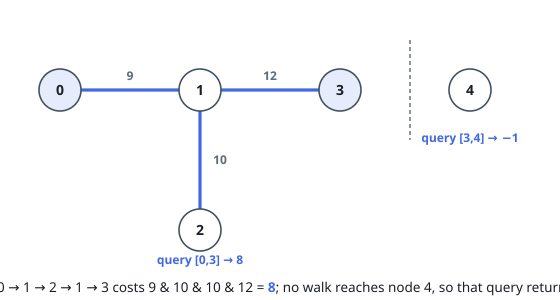
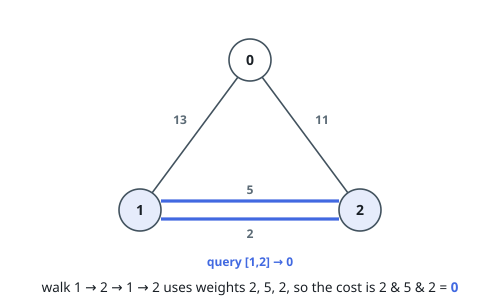

# Minimum AND of a Walk

## Description

An undirected weighted graph has `n` vertices numbered `0` to `n - 1`. You
are given the integer `n` and an array `edges`, where each
`edges[i] = [ui, vi, wi]` joins vertices `ui` and `vi` with weight `wi`.

A **walk** is a sequence of vertices where consecutive vertices are
joined by an edge; vertices and edges may repeat any number of times.
Crossings combine by bitwise AND — a walk over weights
`w0, w1, ..., wk` costs `w0 & w1 & ... & wk`.

Then you are given the array `query`, where `query[i] = [si, ti]`. For
each pair, report the least cost of any walk from `si` to `ti`, or `-1`
when no walk connects them.

Return the array `answer`, where `answer[i]` answers `query[i]`.

### Example 1

```text
Input: n = 5, edges = [[0,1,9],[1,3,12],[1,2,10]], query = [[0,3],[3,4]]
Output: [8,-1]
Explanation: For the first query, walk 0 -> 1 -> 2 -> 1 -> 3, crossing
weights 9, 10, 10, and 12: 9 & 10 & 10 & 12 = 8. For the second query,
vertex 4 has no edges, so nothing reaches it and the answer is -1.
```



### Example 2

```text
Input: n = 3, edges = [[0,2,11],[0,1,13],[1,2,5],[1,2,2]], query = [[1,2]]
Output: [0]
Explanation: Walk 1 -> 2 -> 1 -> 2 across the parallel edges: the two
crossings of the weight-2 edge and one crossing of the weight-5 edge AND
to 2 & 5 & 2 = 0.
```



### Constraints

- `2 <= n <= 10⁵`
- `0 <= edges.length <= 10⁵`
- `edges[i].length == 3`
- `0 <= ui, vi <= n - 1`
- `ui != vi`
- `0 <= wi <= 10⁵`
- `1 <= query.length <= 10⁵`
- `query[i].length == 2`
- `0 <= si, ti <= n - 1`
- `si != ti`

## Hints

### Hint 1

Since edges can be repeated, the tool for grouping reachable vertices is
a disjoint set union over the edge list.

### Hint 2

More crossings can only clear more bits, never set them — so when `u` and
`v` sit in one component, every edge of that component can be swept into
the walk at no penalty, and the best cost stops depending on the route
altogether.
