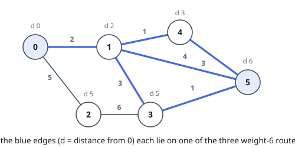
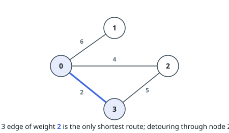

# Edges on Shortest Paths

## Description

An undirected weighted graph has `n` nodes numbered `0` to `n - 1` and `m`
edges. Each `edges[i] = [ai, bi, wi]` joins nodes `ai` and `bi` with an edge
of weight `wi`.

Look at every path from node `0` to node `n - 1` whose total weight is
minimal. Return a boolean array `answer` of length `m` where `answer[i]` is
`true` when edge `i` lies on at least one such minimal path, and `false`
otherwise.

The graph is not guaranteed to be connected.

### Example 1

```text
Input: n = 6, edges = [[0,1,2],[0,2,5],[1,3,3],[1,4,1],[1,5,4],[2,3,6],[3,5,1],[4,5,3]]
Output: [true,false,true,true,true,false,true,true]
Explanation: Three paths from node 0 to node 5 share the minimal total weight 6:
- The path 0 -> 1 -> 5: the sum of weights is 2 + 4 = 6.
- The path 0 -> 1 -> 3 -> 5: the sum of weights is 2 + 3 + 1 = 6.
- The path 0 -> 1 -> 4 -> 5: the sum of weights is 2 + 1 + 3 = 6.
Every edge except 0-2 and 2-3 appears on at least one of these three paths.
```



### Example 2

```text
Input: n = 4, edges = [[2,0,4],[0,1,6],[0,3,2],[3,2,5]]
Output: [false,false,true,false]
Explanation: The one minimal path from node 0 to node 3 is the direct edge
between them, of weight 2; routing through node 2 would cost 4 + 5 = 9. Only
that edge is true.
```



### Constraints

- `2 <= n <= 5 * 10⁴`
- `m == edges.length`
- `1 <= m <= min(5 * 10⁴, n * (n - 1) / 2)`
- `0 <= ai, bi < n`
- `ai != bi`
- `1 <= wi <= 10⁵`
- No pair of nodes is joined by more than one edge.

## Hints

### Hint 1

Fix one edge and ask what a minimal route through it would look like: it
should reach one endpoint as cheaply as possible, cross the edge, and leave
the other endpoint for `n - 1` as cheaply as possible. Which three numbers
therefore decide whether the edge can be part of a shortest path?

### Hint 2

The cheapest cost of reaching every node is a distance array grown from `0`,
and the cheapest cost of leaving every node toward the target is a distance
array grown from `n - 1`. Two Dijkstra runs produce them both.

### Hint 3

Edge `i` qualifies when the distance from `0` to one endpoint, plus `wi`, plus
the distance from the other endpoint to `n - 1` equals the minimal total
weight — in either orientation. When `n - 1` is unreachable no edge can
qualify.
