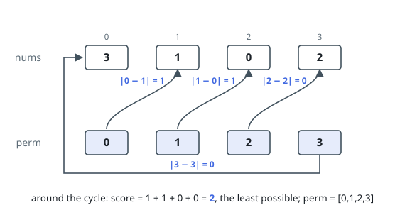

# Minimum-Cost Cyclic Ordering

## Description

You are given `nums`, a permutation of the values `0` through `n - 1`. Choose
an ordering `perm` of those same values and pay

`cost(perm) = |perm[0] - nums[perm[1]]| + |perm[1] - nums[perm[2]]| + ... + |perm[n-1] - nums[perm[0]]|`

— each entry of `perm` is measured against the entry of `nums` that its
successor points to, and the last wraps around to the first.

Return an ordering of least possible cost; if several tie, return the
lexicographically smallest among them.

### Example 1

```text
Input: nums = [3,1,0,2]
Output: [0,1,2,3]
Explanation: The natural ordering costs |0 - 1| + |1 - 0| + |2 - 2| + |3 - 3|
= 2, and no ordering of the four values can do better. Among the optimal
orderings this one is lexicographically smallest.
```



### Example 2

```text
Input: nums = [2,3,0,1]
Output: [0,2,1,3]
Explanation: Trading the middle two entries costs |0 - 0| + |2 - 3| + |1 - 1|
+ |3 - 2| = 2, while the natural ordering [0,1,2,3] would cost |0 - 3| + |1 - 0|
+ |2 - 1| + |3 - 2| = 6. The trade is optimal and lexicographically smallest.
```

![A trade of the middle positions saves four units, score 2 with perm = [0,2,1,3].](figures/example-2.svg)

### Example 3

```text
Input: nums = [4,0,3,1,2]
Output: [0,1,3,2,4]
Explanation: A single trade of the middle two entries aligns every pair:
each of the five terms is zero, so the total is 0.
```

### Constraints

- `2 <= n == nums.length <= 14`
- `nums` is a permutation of the values `0` through `n - 1`

## Hints

### Hint 1

Rotating an ordering leaves its cost alone, so some rotation of every optimal
ordering begins with 0 — pin the first entry there and the lexicographic
promise comes free.

### Hint 2

With the first entry pinned, filling in the rest while paying each new term is
a cousin of the Traveling Salesman Problem.

### Hint 3

Track the set of values already placed with a bitmask and solve by dynamic
programming over (set, last value placed).
