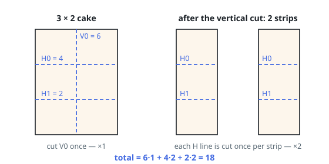

# Solutions — Cheapest Cuts to Unit Cells

## Greedy merge of descending cut prices

Every line is eventually sliced along its whole length; what the order decides
is only how many pieces each slice crosses. After `k` vertical cuts exist, any
horizontal line threads `k + 1` separate pieces and pays its price that many
times, and the mirror statement holds for vertical lines. So each cut's bill
grows with every opposite cut that precedes it, which suggests doing the
expensive lines first, while their multiplier is still `1`.

An exchange argument turns the suggestion into a proof: given two adjacent cuts
of opposite directions, swapping them never lowers the total when the pricier
one leads — the cheaper cut's multiplier drops by one while the pricier one's
rises by one, a trade that only ever helps when the leading cut costs at least
as much. Repeatedly applying such swaps leaves a schedule in which both price
lists are consumed in descending order.

The code implements exactly that as a two-pointer merge over the two
descending lists. Each step takes whichever head costs more, charging
`price * (opposite cuts made so far + 1)` and bumping that direction's
counter; ties may go to the horizontal head, since equal prices are
interchangeable in the exchange argument. Once one list runs out, the other
direction's multiplier is frozen and its remaining lines pay that fixed
factor.

A rectangle DP keyed on sub-piece corners also solves the task, but the merge
is the global optimum, not an approximation, and it never looks at `m` or `n`
beyond the list lengths — reaching all `1 x 1` pieces simply means every line
is eventually consumed, which the two drain loops guarantee.

**Complexity:** `O(m log m + n log n)` time, `O(m + n)` space.
