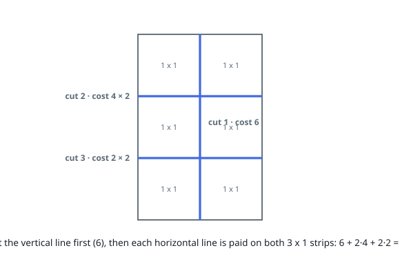

# Cheapest Cuts to Unit Cells

## Description

An `m x n` cake is to be divided into `1 x 1` pieces.

You are given the integers `m` and `n`, plus two price lists:

- `horizontalCut` has `m - 1` entries, where `horizontalCut[i]` is the price
  of cutting along horizontal line `i`.
- `verticalCut` has `n - 1` entries, where `verticalCut[j]` is the price of
  cutting along vertical line `j`.

One operation selects any current piece larger than `1 x 1` and slices that
piece in two — either along one of the horizontal lines or along one of the
vertical lines that cross it — paying that line's price. A line's price is
fixed: it stays the same no matter how often, or across how many separate
pieces, that line ends up being cut.

Return the smallest total price needed to reduce the whole cake to `1 x 1`
pieces.

### Example 1

```text
Input: m = 3, n = 2, horizontalCut = [4,2], verticalCut = [6]
Output: 18
Explanation: Cut vertical line 0 once, paying 6; the cake becomes two `3 x 1`
strips. Horizontal line 0 must then be sliced through both strips, paying 4
twice, and likewise horizontal line 1 pays 2 twice:
6 + 2·4 + 2·2 = 18.
```



### Example 2

```text
Input: m = 2, n = 2, horizontalCut = [3], verticalCut = [8]
Output: 14
Explanation: The pricier line goes first: cut vertical line 0 once (8),
leaving two `1 x 2` pieces, then pay 3 on each of them for the horizontal
line: 8 + 3 + 3 = 14.
```

### Example 3

```text
Input: m = 1, n = 4, horizontalCut = [], verticalCut = [5,2,1]
Output: 8
Explanation: With a single row there is nothing to multiply any price: every
vertical line is cut exactly once, for 5 + 2 + 1.
```

### Constraints

- `1 <= m, n <= 20`
- `horizontalCut.length == m - 1`
- `verticalCut.length == n - 1`
- `1 <= horizontalCut[i], verticalCut[j] <= 10³`

## Hints

### Hint 1

Ask what a line ends up costing in total, rather than which piece to slice
next: it is its price times the number of pieces it has to be cut through.

### Hint 2

Once `k` cuts of one direction have been made, every line of the other
direction crosses `k + 1` pieces. Cutting early in the opposite direction is
what raises a line's bill.

### Hint 3

Take any two consecutive cuts of opposite directions and try swapping them.
Unless the pricier cut already goes first, the swap does not raise the total —
so which global schedule survives every such swap?
