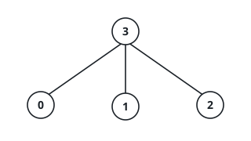
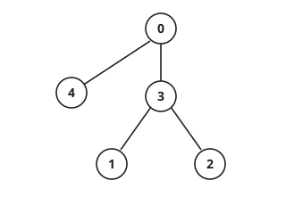

# Marking Spread Times on a Tree

## Description

You are given an undirected tree with `n` nodes numbered `0` to `n - 1`,
described by the array `edges` of length `n - 1`: each entry `[u, v]` joins
`u` and `v`.

Every node starts unmarked. Marking spreads by parity of the node id:

- an **odd** node becomes marked at time `x` when some neighbor of it was
  already marked at time `x - 1`;
- an **even** node becomes marked at time `x` when some neighbor of it was
  already marked at time `x - 2`.

Return an array `times` in which `times[i]` is the moment the whole tree is
marked, in the scenario where node `i` is marked by hand at time `0`. The
scenarios are independent — in each one every other node starts unmarked.

### Example 1

```text
Input: edges = [[3,0],[3,1],[3,2]]
Output: [3,3,3,2]
Explanation: The hub 3 is odd. Started there, its odd leaf 1 is marked at
time 1 while the even leaves 0 and 2 wait until time 2, so everything is
marked at time 2. Started at 0, the hub follows at time 1, leaf 1 at time 2,
and the even leaf 2 only at time 3; by symmetry the same total, 3, holds when
starting from 1 or 2.
```



### Example 2

```text
Input: edges = [[0,3],[3,1],[1,2]]
Output: [4,3,4,3]
Explanation: The chain 0 - 3 - 1 - 2 alternates even, odd, odd, even.
Started at either end node, the mark pays one step into node 3, one more
into node 1, and two final steps into the even node 2 (or 0), finishing at
time 4. Started at node 3, the far ends 0 and 2 are both even and both land
at time 3; the same total comes from starting at node 1.
```

### Example 3

```text
Input: edges = [[0,4],[0,3],[3,1],[3,2]]
Output: [3,5,5,4,5]
Explanation: Root 0 hangs leaf 4 and hub 3 off itself, and the hub carries
leaves 1 and 2. From 0, the hub arrives at time 1, its odd leaf 1 at time 2,
its even leaf 2 at time 3, and the even leaf 4 at time 2 — everything by 3.
Starting from the far leaf 4 instead costs two steps back to 0, one to the
hub, and up to two more to leaf 2, for a total of 5.
```



### Constraints

- `2 <= n <= 10⁵`
- `edges.length == n - 1`
- each entry of `edges` has two elements
- `0 <= edges[i][0], edges[i][1] <= n - 1`
- the edges describe a valid tree

## Hints

### Hint 1

Read the rule as an edge weight: crossing into a node costs `1` when its id
is odd and `2` when it is even. What is `times[i]` in these terms?

### Hint 2

`times[i]` is the weighted height of the tree when rooted at `i` — the
longest root-to-node path under those crossing costs. Computing a height per
root is quadratic; what can one rooted pass plus one re-rooting sweep give
you?

### Hint 3

While pushing answers down, a node must be able to offer each child its best
route that avoids going back through that same child — which is why two
backup values, not one, are kept per node.
