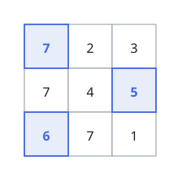
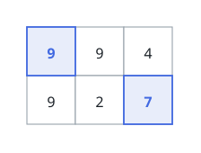

# Largest Distinct-Value Sum Across Grid Rows

## Description

You are given a matrix `grid` of positive integers.

Choose a set of cells that obeys both rules:

- no two chosen cells lie in the same row;
- no two chosen cells hold the same value.

At least one cell must be chosen. The score of a choice is the sum of the
chosen values.

Return the largest score achievable.

### Example 1

```text
Input: grid = [[7,2,3],[7,4,5],[6,7,1]]
Output: 18
Explanation: The value 7 appears in every row, but distinctness allows it to
be taken only once — from the top row. The remaining rows then contribute
their best non-7 entries: 5 from the middle row and 6 from the bottom, for
7 + 5 + 6 = 18.
```



### Example 2

```text
Input: grid = [[9,9,4],[9,2,7]]
Output: 16
Explanation: A 9 exists in both rows, yet only one of them may be chosen.
Taking 9 from the top row frees the bottom row to give its 7: 9 + 7 = 16.
```



### Constraints

- `1 <= grid.length, grid[i].length <= 10`
- `1 <= grid[i][j] <= 100`

## Hints

### Hint 1

Columns never matter — only which values occur in which rows. How small a
summary of the grid captures exactly that?

### Hint 2

With at most 10 rows, the set of rows already used by a partial choice fits
in a bitmask. What should `dp[mask]` store, and in what order should values
be considered?
