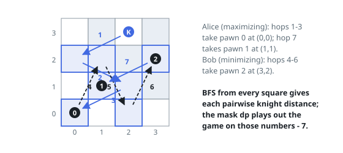

# Solutions — Most Knight Moves to Clear Every Pawn

## BFS distance precomputation with minimax bitmask dp

Once you see that the knight always ends a turn standing on the pawn it just
removed, the game state collapses to two facts: which pawns are gone, and
which of their squares the knight occupies. Distances do the rest — so the
prep stage runs one breadth-first search per pawn across the whole board,
producing the full pawn-to-pawn distance matrix, and reading each of those
grids at `(kx, ky)` gives the knight's opening distances without any extra
work.

On top of the distance table sits a minimax over subsets. `dp(mask, last)`
counts the hops still owed once the pawns in `mask` are gone and the knight
rests on pawn `last`; whose choice it is falls out of the popcount of `mask`,
Alice maximizing on even counts and Bob minimizing on odd ones. A transition
selects any surviving pawn `j`, pays `dist[last][j]` for its capture, and
recurses with `j` folded into the mask. Memoization makes the `2^m · m` state
space — minute for `m <= 15` — and the outermost loop tries each opening
pawn, paying the start-to-pawn distance for Alice's first move.

Why so little state suffices: knight distances are metric, so the route the
knight took to its current square has no bearing on what any later capture
costs — only the square itself matters. Each turn removes exactly one pawn,
so the max/min objective alternates strictly with popcount, and passing over
unselected pawns costs nothing because BFS never cared about intermediate
occupancy. A lone pawn (example 1) degenerates to a single start-to-pawn
distance, which the board edge can inflate to four hops even between
nearby squares.

**Complexity:** `O(50² · m + 2^m · m²)` time, `O(2^m · m)` space.
