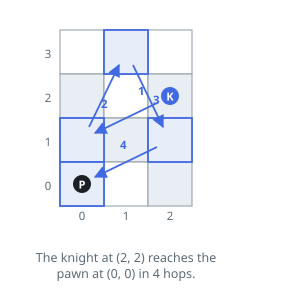
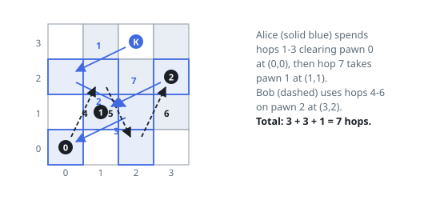
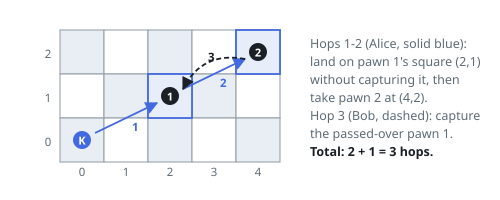

# Most Knight Moves to Clear Every Pawn

## Description

A `50 x 50` chessboard holds one knight and some pawns. The knight begins at
`(kx, ky)`, and `positions[i] = [xi, yi]` is the square of pawn `i`. A knight
move is the standard chess jump: two squares in one of the four directions,
then one square sideways.

Alice and Bob move the knight in turns, Alice first. On a turn the player
picks **any** pawn still on the board and captures it, riding the knight to
that pawn by a **shortest** sequence of knight moves. The number of hops in
that shortest path is charged to the game. Any pawns whose squares the knight
crosses along the way stay put — only the chosen pawn is removed.

Alice wants the game's total hop count, over both players, to end up large;
Bob wants it small. Assuming both always play their best, return that total.

### Example 1

```text
Input: kx = 2, ky = 2, positions = [[0,0]]
Output: 4
Explanation: With one pawn there are no choices, only distance. On this
board the shortest route from (2, 2) to (0, 0) takes four hops, for instance
(2,2) -> (0,1) -> (1,3) -> (2,1) -> (0,0).
```



### Example 2

```text
Input: kx = 2, ky = 3, positions = [[0,0],[1,1],[3,2]]
Output: 7
Explanation: Alice opens on pawn 0 at (0, 0), three hops away. Bob answers by
taking pawn 2 at (3, 2), also three hops. Alice then finishes pawn 1 at
(1, 1), a single hop from the knight's current square: 3 + 3 + 1 = 7. Every
other line of play lets Bob keep the total at most this small.
```



### Example 3

```text
Input: kx = 0, ky = 0, positions = [[2,1],[4,2]]
Output: 3
Explanation: Alice heads for the farther pawn: (0,0) -> (2,1) -> (4,2),
landing on pawn 1's square midway without capturing it, then taking pawn 2
after 2 hops. Bob collects the pawn that was passed over in a single hop:
2 + 1 = 3.
```



### Constraints

- `0 <= kx, ky <= 49`
- `1 <= positions.length <= 15`
- each entry of `positions` has two elements
- `0 <= positions[i][0], positions[i][1] <= 49`
- all pawn squares are distinct
- no pawn starts on the knight's square

## Hints

### Hint 1

Whatever order the pawns fall in, each leg of the game is a shortest knight
path between two fixed squares. Which all-pairs numbers does that suggest
precomputing, and by what method?

### Hint 2

Treat the knight's starting square as one more node in that distance table.

### Hint 3

Fifteen pawns fit in a bitmask. Over the set of still-standing pawns, whose
turn is it — and does that state want a maximum or a minimum?
