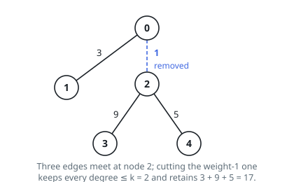

# Heaviest Forest Under a Degree Cap

## Description

You are given the edge list of a tree on `n` nodes numbered `0` to
`n - 1`: `edges[i] = [ui, vi, wi]` says nodes `ui` and `vi` are joined by
an edge of weight `wi`. You are also given an integer `k`.

Delete zero or more edges so that, in what remains, no node is joined to
more than `k` other nodes.

Return the largest possible total weight of the remaining edges.

### Example 1

```text
Input: edges = [[0,1,3],[0,2,1],[2,3,9],[2,4,5]], k = 2
Output: 17
Explanation: Node 2 touches three neighbors, one too many, and its
cheapest edge is the weight-1 link to node 0. Deleting it leaves the
weights 3 + 9 + 5 = 17, and nothing better is possible.
```



### Example 2

```text
Input: edges = [[0,1,6],[1,2,8],[2,3,4]], k = 2
Output: 18
Explanation: The tree is a path, so both endpoints meet one neighbor and
both interior nodes meet two. Nothing has to go, and the full weight
6 + 8 + 4 = 18 survives.
```

### Example 3

```text
Input: edges = [[0,1,2],[0,2,9],[0,3,4],[0,4,7]], k = 2
Output: 16
Explanation: Node 0 meets four neighbors but may keep only two, and the
heaviest pair is the weight-9 and weight-7 edges: 9 + 7 = 16.
```

### Constraints

- `2 <= n <= 10⁵`
- `1 <= k <= n - 1`
- `edges.length == n - 1`
- every entry is `[ui, vi, wi]` with `0 <= ui, vi <= n - 1` and
  `1 <= wi <= 10⁶`
- the listed edges form a valid tree

## Hints

### Hint 1

Root the tree somewhere. For each node, the cap is a budget shared
between the edge above it and the edges below it.

### Hint 2

For every edge to a child, both fates need a number: the best total in
the child's subtree with that edge deleted, and the best with it kept.

### Hint 3

Compare the two fates edge by edge; the difference tells you which child
edges earn their slot. Sort those differences and spend the budget on
the largest.
